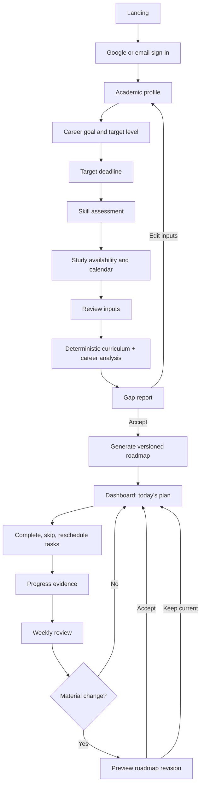
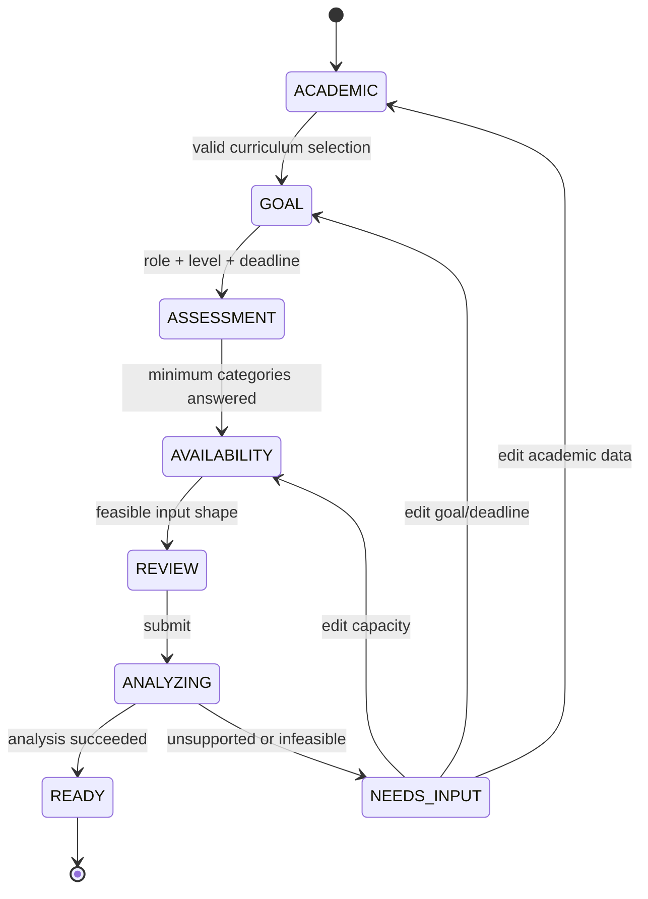
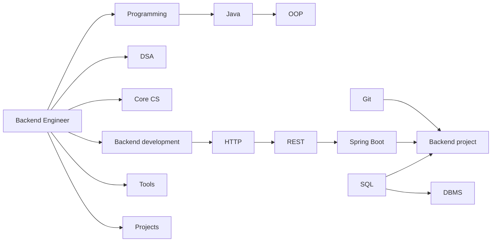
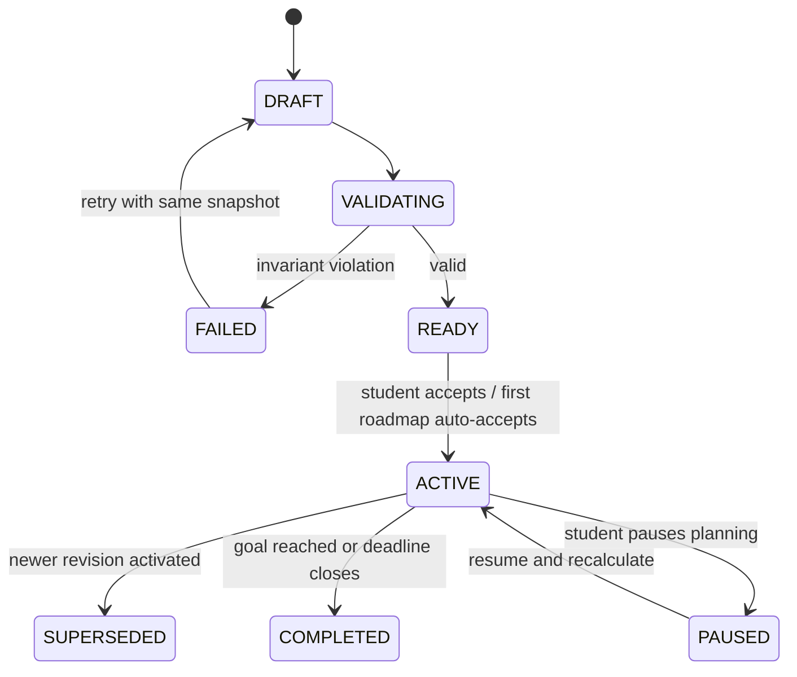
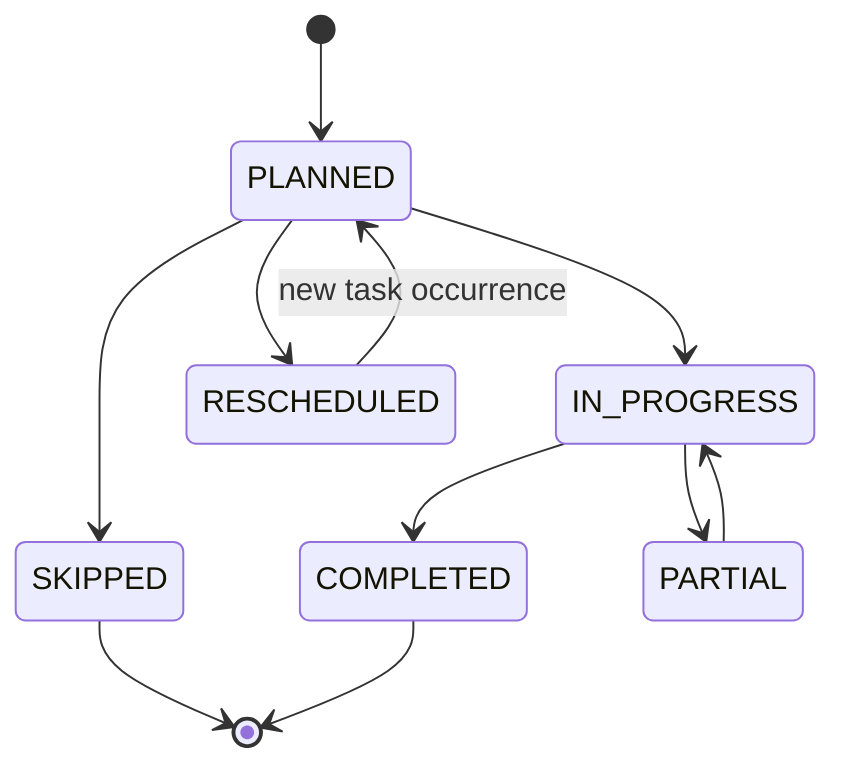
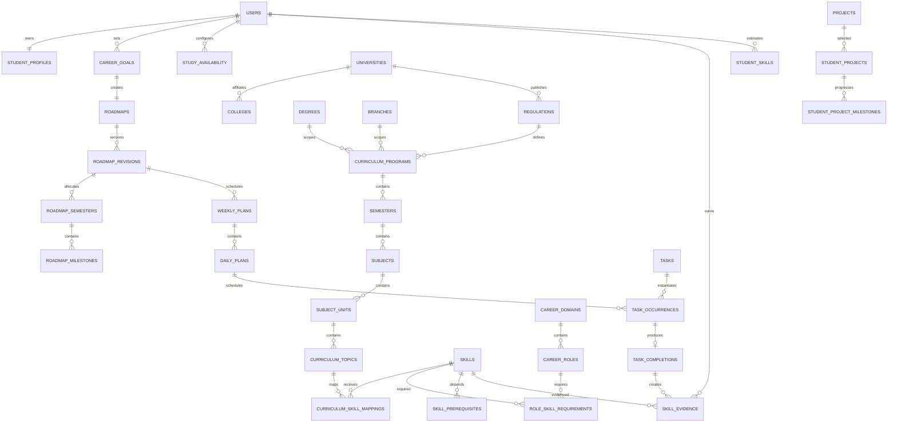
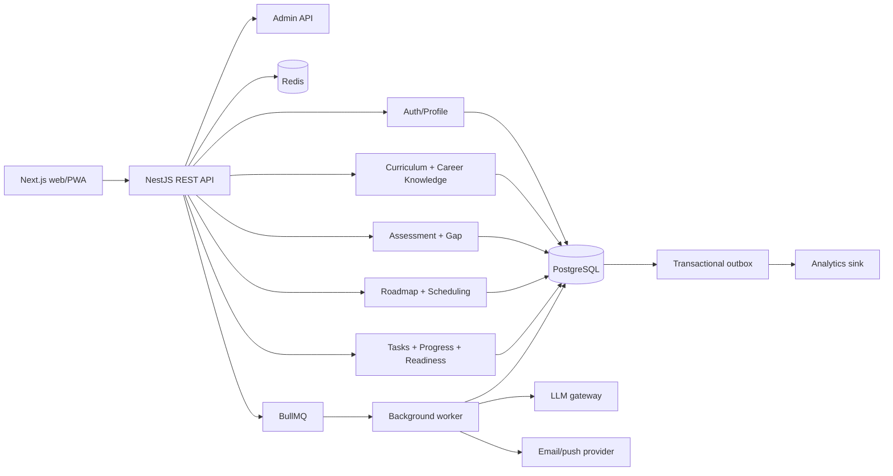
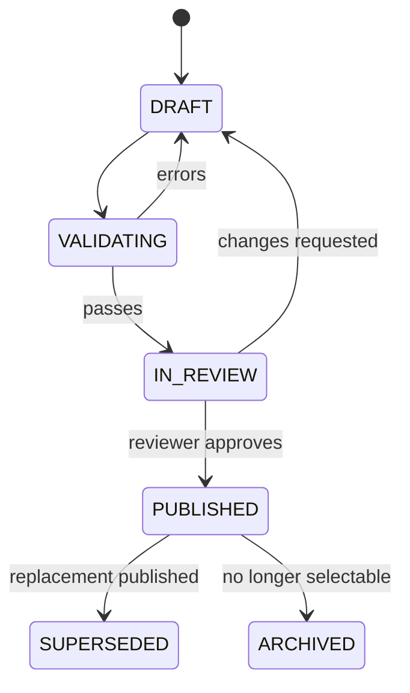
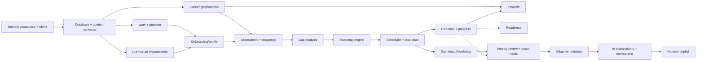

# StudentOS — Product Development Specification

**Status:** Implementation baseline  
**Version:** 1.0  
**Date:** 24 August 2026  
**Primary launch market:** JNTUH and affiliated colleges, Telangana  
**Audience:** Product, design, engineering, data, AI, QA, DevOps, content operations, and coding agents

> This document is the source of truth for product behavior. If implementation and this specification disagree, create a decision record and update this document before changing behavior. Curriculum facts, role requirements, and effort estimates must be versioned data—not assumptions embedded in code or LLM prompts.

## 1. Executive Summary

StudentOS is a personal academic and career navigation system for B.Tech students. It combines a student's university curriculum, current semester, existing skills, career target, available study time, academic calendar, and progress to produce an explainable graduation roadmap and executable daily plan.

The system does not ask an LLM to invent a roadmap. A versioned curriculum graph and career knowledge graph define what exists, what depends on what, how deeply a role requires it, how college contributes, and how much effort remains. A deterministic planning engine computes the gap and schedules it within real capacity. AI is restricted to explanations, coaching, resource summaries, and constrained schedule assistance; the application remains functional if AI is unavailable.

The MVP proves one hypothesis: **a curriculum-aware plan is materially more useful and sustainable than a generic career roadmap.** It supports JNTUH R22/R25, B.Tech CSE and IT, and four roles: Software Engineer, Backend Engineer, Full-Stack Engineer, and Data Analyst. It includes onboarding, assessment, gap analysis, semester/month/week/day planning, task progress, exam mode, weekly review, and bounded recalculation.

### Success definition

Within 10 minutes, an eligible student can complete onboarding and receive a plan in which:

- every recommended learning item has a traceable reason;
- curriculum overlap is reused without treating academic exposure as career mastery;
- prerequisites and the target deadline are respected;
- planned work remains within 85% of declared study capacity, leaving recovery buffer;
- completing or missing work changes future—not completed—plans;
- changing role preserves evidence for transferable skills.

### Product assumptions

| ID | Assumption | Validation method |
|---|---|---|
| A1 | Students can reliably identify university, regulation, branch, and semester. | Onboarding analytics and support tickets. |
| A2 | Official curriculum documents can be converted into topic-level structured data. | Content-ops pilot for two regulations and two branches. |
| A3 | Self-assessment is directionally useful when confidence is reduced until behavioral evidence exists. | Compare self-rating with diagnostic and task evidence. |
| A4 | Students will provide realistic weekly availability if shown the resulting workload immediately. | Compare declared versus completed hours over four weeks. |
| A5 | A role can be represented as versioned skill requirements without an LLM being the source of truth. | Expert review and roadmap regression fixtures. |
| A6 | Placement season and exam dates vary by college; manual dates are required even when a template calendar exists. | Calendar correction rate by college. |

### Unresolved risks

| Risk | Impact | Mitigation / decision gate |
|---|---|---|
| Curriculum data is incomplete or legally unusable. | Incorrect plans; trust loss. | Store source URL/document checksum and reviewer; publish only verified records; obtain permission where required. |
| Role definitions become opinionated or stale. | Biased recommendations. | Quarterly review, effective dates, expert sign-off, and impact preview before publish. |
| Self-reported skill inflation. | Work is skipped incorrectly. | Confidence-weighted evidence, short diagnostics, and no mastery from self-report alone. |
| A deadline is mathematically infeasible. | False promise. | Capacity feasibility check; show deficit and selectable trade-offs rather than silently overbooking. |
| Academic calendars are inaccurate. | Exam-mode scheduling fails. | Student-confirmed dates override templates; reminders to confirm. |
| Students interpret readiness as employment probability. | Misleading claims. | Label it “preparation readiness,” publish its components, and never predict salary or hiring outcome. |
| Plans become overwhelming. | Low retention. | Default hierarchy is Today → Week → Month → Semester → Graduation; progressive disclosure throughout. |

## 2. Product Vision

Enable every B.Tech student to make a credible connection between what college teaches today and what a chosen career requires tomorrow, then convert that understanding into a sustainable daily practice.

North-star experience: **“Open StudentOS and know the most useful thing to do next—and why.”**

## 3. Problem Statement

Generic roadmaps ignore curriculum timing, prior knowledge, study capacity, examinations, and target depth. Students consequently duplicate beginner courses, postpone useful academic topics, attempt projects before prerequisites, or accept schedules that cannot fit alongside college. Academic planners have the opposite flaw: they optimize for exams without showing career transfer.

StudentOS must solve four linked problems:

1. **Relevance:** determine which knowledge is required for a chosen role and target level.
2. **Reuse:** identify how completed/current/future curriculum contributes and where deeper practice is needed.
3. **Feasibility:** allocate remaining work across the actual time available before a deadline.
4. **Adaptation:** recalculate future work from evidence without erasing completed progress.

## 4. Target Users

### Primary personas

| Persona | Situation | Primary need | Product response |
|---|---|---|---|
| Early explorer | Year 1–2, little experience, uncertain role | Direction without premature specialization | Common foundation plus lightweight role exploration. |
| Goal-oriented builder | Year 2–3, chosen role, some skills | Coordinate academics, DSA, development, and projects | Mapped semester plan and prerequisite-safe project timing. |
| Placement-focused student | Year 3–4, short deadline | Ruthless prioritization and readiness visibility | Feasibility warning, placement mode, revision and evidence gaps. |
| Career switcher | Existing roadmap, new role | Preserve prior work | Transferability comparison and revision diff. |
| Academically constrained student | Exams/backlogs or ≤1 hour/day | Maintain progress without overload | Exam mode, minimum viable continuity, and trade-off plan. |

### Operational users

- Curriculum editors enter official university structures and topic coverage.
- Career editors maintain role requirements, prerequisites, projects, and target depths.
- Reviewers publish versioned datasets and inspect impact.
- Support operators can inspect plan inputs and revisions but cannot edit student evidence.
- Product analysts view aggregate, de-identified funnel and adherence data.

MVP is not designed for schools, non-degree bootcamps, employers, recruiters, or a mentorship marketplace.

## 5. Product Positioning

**Category:** Academic-aware career planning for higher education.  
**Positioning statement:** For B.Tech students who need to prepare for a career without ignoring college, StudentOS turns official curriculum, skill evidence, goals, and realistic time into a living, explainable plan. Unlike static roadmap sites or generic AI answers, each recommendation is data-backed, scheduled around academics, and revised from progress.

## 6. Core Value Proposition

| Student question | StudentOS answer |
|---|---|
| What should I learn? | Required role skills at the selected target depth. |
| Do I already know it? | Current proficiency with evidence confidence. |
| Will college teach it? | Completed/current/future topic mappings and coverage depth. |
| What is still missing? | Extension and career-only gaps. |
| When should I do it? | Prerequisite-safe semester, month, week, and day allocation. |
| Can this fit? | Capacity calculation, buffer, and deadline risk. |
| Why is this task here? | Trace from task to skill, requirement, milestone, and curriculum topic. |
| What if life changes? | Versioned future-plan recalculation with completed work preserved. |

## 7. Product Principles

1. **Structured truth, generated explanation.** Curriculum and career facts come from reviewed data.
2. **Every item is explainable.** No task without a reason code and traceable source.
3. **College exposure is not mastery.** Coverage depth and career-required depth are compared explicitly.
4. **No duplicate beginner learning.** Sufficient verified coverage removes redundant foundations.
5. **Capacity is a hard constraint.** The engine does not hide overload in a long list.
6. **Prerequisites are hard gates.** Projects and advanced topics cannot precede required foundations.
7. **Completed history is immutable.** Recalculation replaces only unlocked future plan versions.
8. **Progress requires evidence.** Time and checkmarks support progress but do not alone prove proficiency.
9. **Show the next horizon first.** Today precedes the complete roadmap.
10. **Readiness is preparation, not hiring probability.** Scores are transparent and role-specific.
11. **Grace over punishment.** Missed tasks trigger replanning, not shame or broken streak theatrics.
12. **Accessible and calm by default.** The interface is professional, low-noise, and usable on low-end mobile devices.

## 8. Complete User Journey



### First-run journey

1. Landing page demonstrates one curriculum-to-career mapping and a sample plan; CTA is **Build my roadmap**.
2. Sign-in creates a minimal user record. No dashboard is shown until required onboarding is complete.
3. Academic selections are dependent: university → regulation → degree → branch → semester. Invalid combinations cannot be submitted.
4. Role selection shows expected skill categories and makes target level explicit. “Not sure” launches a common-foundations exploratory plan in V1.1; MVP requires one of four roles.
5. The deadline defaults to the earlier of student-entered placement season or graduation minus four months; the student confirms it.
6. Assessment is adaptive. The user rates skill statements and may take a five-to-ten-minute diagnostic; unanswered skills default to unknown, not zero.
7. Availability captures day-level windows, maximum session duration, exam/vacation behavior, and timezone.
8. A review page highlights unsupported curriculum or infeasible time before generation.
9. The gap report appears before the roadmap and clearly separates current readiness, future college contribution, and independent gap.
10. Generation creates an immutable input snapshot and a roadmap version. The dashboard opens on the first feasible task, not the graduation view.

### Returning journey

1. Dashboard displays today, week completion, next milestone, and one relevant alert.
2. A completion records actual duration, optional difficulty, and evidence such as DSA result or project milestone.
3. The weekly review confirms workload difficulty and upcoming calendar changes.
4. Small changes are applied automatically to the next draft week; material changes present a diff for consent.
5. Role, branch, regulation, or deadline changes always create a recalculation preview.

## 9. Onboarding Architecture

### Step contract

| Step | Required fields | Validation | Saved behavior |
|---|---|---|---|
| Account | Google OAuth or verified email magic link | Verified provider/email | `users`, onboarding status `ACADEMIC`. |
| Academic | University, regulation, degree, branch, current semester, expected graduation | Combination exists and curriculum is published | Profile plus curriculum version snapshot. |
| Optional academic | CGPA, backlogs, strong/weak subjects | CGPA in university scale; backlog count ≥0 | Skippable; backlogs only affect capacity unless user opts in. |
| Goal | Domain, role, target level | Published compatible role and level | Career-goal version. |
| Deadline | Date and basis | Future date; not after graduation unless higher studies | Feasibility preview. |
| Skills | Required category statements; diagnostic optional | Enum levels; diagnostic server-scored | Assessment and skill evidence. |
| Availability | Day windows, exam/vacation mode, max session | 0–24h/day; no overlaps; timezone required | Effective-dated weekly availability. |
| Preferences | Language, session style, reminders | Supported values | Skippable except language/timezone. |
| Review | Consent and final input summary | All required steps complete | Frozen generation input. |

Autosave each step, allow backward navigation, and resume on the last incomplete step. Changing an upstream academic field invalidates incompatible downstream selections but never silently deletes them; the UI requests confirmation and records an audit event.

### Onboarding state machine



## 10. Academic Intelligence Architecture

The curriculum is a versioned hierarchy:

```text
University
└── Regulation (effective year, source, version)
    └── Degree
        └── Branch
            └── Semester
                └── Subject (credits, type, lecture/lab)
                    └── Unit
                        └── Curriculum topic
```

Each topic has a stable canonical concept link where possible. For example, multiple subject phrases may map to canonical skill `database.sql.joins`. The curriculum record expresses **academic coverage**, while the role requirement expresses **required career depth**.

Required topic metadata:

- source document ID, page reference, reviewer, publication status, and effective dates;
- lecture/lab type, contact hours, assessment weight if known;
- canonical skill mappings with breadth `[0,1]`, depth `[0,1]`, confidence `[0,1]`, and mapping rationale;
- prerequisites within the curriculum;
- semester timing and whether the student reports the topic completed;
- academic, placement, and role relevance labels derived from mappings, not free text.

### Version behavior

- Published curriculum versions are immutable.
- A profile references the version selected at roadmap generation.
- A new version does not alter an active roadmap automatically. The system runs an impact comparison and offers a revision if material.
- Historical tasks retain links to the old version so explanations remain reproducible.
- Missing curriculum creates an `UNSUPPORTED_CURRICULUM` state; it never falls back to an invented AI syllabus.

## 11. Career Knowledge Architecture

The career graph is a reviewed directed acyclic graph of skills and prerequisites. Cycles fail publication validation.



For every role-skill requirement store:

- target-level-specific required proficiency `[0,1]`;
- role importance `[0,1]` and placement relevance `[0,1]`;
- required versus optional flag;
- recommended completion offset from deadline;
- estimated novice-to-target hours with a range;
- accepted evidence types and expiry period, where relevant;
- project templates that demonstrate the skill;
- dataset version, rationale, reviewer, and effective dates.

### MVP role decision

| Role | Why included | Main distinction |
|---|---|---|
| Software Engineer | Broadest placement target and common foundation. | High DSA/core CS; one deployable software project. |
| Backend Engineer | Validates deep specialization and curriculum overlap. | High databases/API/backend/tools weight. |
| Full-Stack Engineer | Validates multi-track scheduling. | Balanced frontend/backend, lower core-CS depth than SWE placement target. |
| Data Analyst | Validates a different skill family without ML infrastructure. | SQL, spreadsheets/BI, statistics, data storytelling, portfolio analyses. |

AI/ML, cybersecurity, DevOps/cloud, mobile, data engineering, embedded, and core engineering roles require separate expert-reviewed graphs and are not credible MVP add-ons.

## 12. Skill Assessment Model

### Proficiency scale

Use one canonical numeric scale internally and category-specific language in the UI.

| Level | Value | Meaning | Evidence expectation |
|---|---:|---|---|
| Unknown | null | Not assessed | Must not be treated as zero or mastered. |
| Not started | 0.00 | No exposure | Self-report is sufficient. |
| Aware | 0.20 | Recognizes terms or syntax | Self-report. |
| Basic | 0.40 | Completes guided/basic tasks | Self-report plus optional diagnostic. |
| Applied | 0.60 | Uses independently in bounded work | Completed exercises or project artifact. |
| Proficient | 0.80 | Solves varied, role-relevant tasks | Diagnostic/project evidence. |
| Interview/production ready | 1.00 | Performs under target conditions | Timed assessment, reviewed project, or mock interview. |

Assessment statements are skill-specific (“Can implement pagination in a REST API”) rather than confidence adjectives. The engine stores the raw answer, normalized value, evidence source, confidence, and assessment version.

### Evidence confidence

| Evidence | Default confidence |
|---|---:|
| Self-report only | 0.45 |
| Imported course completion | 0.55 |
| In-app untimed exercise | 0.70 |
| In-app diagnostic/timed DSA result | 0.80 |
| Completed roadmap task with artifact | 0.82 |
| Rubric-validated project milestone | 0.90 |
| Reviewed mock interview/mentor assessment | 0.90 |

The current skill estimate is the recency-weighted combination of evidence, not the latest checkmark. MVP supports self-report, lightweight diagnostics for programming/DSA/SQL, task evidence, and project milestones. It must label lower-confidence estimates.

`effective_proficiency = estimated_proficiency × (0.70 + 0.30 × evidence_confidence)`

This limits the penalty for new users while preventing self-report from producing full readiness.

## 13. Curriculum-Career Mapping System

Each `curriculum_skill_mapping` links one topic to one canonical skill and records:

```json
{
  "curriculumTopicId": "ct_sql_joins",
  "skillId": "skill_sql_joins",
  "breadth": 0.8,
  "depth": 0.55,
  "confidence": 0.95,
  "practiceRequired": true,
  "evidencePotential": 0.45,
  "rationale": "Curriculum teaches join types but not production query analysis.",
  "version": 3
}
```

Classification for a required skill with student proficiency `P`, role-required depth `R`, curriculum depth `C`, curriculum timing `T`, and deadline `D`:

1. `P >= R`: **already mastered**; schedule only spaced revision when placement-relevant.
2. Current curriculum and `C >= R`: **college covered**; add assessment/practice, not a duplicate course.
3. Current/future curriculum before its required-by date and `0 < C < R`: **college + career extension**; schedule extension after/alongside the mapped topic.
4. Future curriculum arrives after the required-by date: treat as **independent now**, and mark later academic work as reinforcement.
5. No reliable mapping: **career-only**.
6. Optional, low-importance requirements that cannot fit: **deferred/low priority**, visibly excluded.

Academic overlap affects timing and remaining effort, not role importance. Mapping confidence below 0.65 is shown to admins as review-needed and cannot remove a required foundation from a student plan.

## 14. Gap Analysis Engine

### Inputs

- frozen profile and goal snapshot;
- published curriculum and career-graph versions;
- current skill estimates and confidence;
- curriculum timing relative to required-by dates;
- availability, exam periods, vacations, and deadline.

### Per-skill contribution model

For role weights normalized to sum to 1:

```text
current_i  = min(effectiveProficiency_i / requiredDepth_i, 1)
college_i  = min(max(curriculumDepthBeforeDeadline_i - effectiveProficiency_i, 0)
                 / requiredDepth_i, 1 - current_i) × mappingConfidence_i
external_i = max(0, 1 - current_i - college_i)

current readiness       = Σ(weight_i × current_i) × 100
future college gain     = Σ(weight_i × college_i) × 100
independent gap         = Σ(weight_i × external_i) × 100
```

The three top-level values sum to 100% after rounding reconciliation. “Future college gain” is a planning estimate, not existing readiness. The UI must never label it as mastered.

### Outputs

- readiness by skill category and evidence confidence;
- each requirement classified into mastered, partial, college-current, college-future, extension, independent, deferred, or not required;
- remaining effort range and capacity feasibility;
- curriculum contribution with subject/semester trace;
- strengths, highest-value gaps, deadline risks, and data-quality warnings;
- explanation reason codes such as `ROLE_REQUIRED`, `PLACEMENT_REQUIRED`, `PREREQUISITE_OF`, `ACADEMIC_EXTENSION`, and `PROJECT_EVIDENCE`.

### Example gap result

| Skill | Current | Required | College contribution | Classification | Remaining effort |
|---|---:|---:|---|---|---:|
| Java/OOP | 0.45 | 0.75 | OOP current semester, depth 0.60 | College + extension | 28h |
| DSA trees | 0.20 | 0.80 | DS current semester, depth 0.50 | College + extension | 36h |
| SQL | 0.35 | 0.75 | DBMS next semester, depth 0.55 | College future + extension | 22h |
| Spring Boot | 0.00 | 0.70 | None | Career-only | 55h |
| Docker | 0.00 | 0.50 | None | Career-only | 18h |

Before roadmap generation the user sees “Known now,” “College will contribute,” and “You will learn independently,” plus any feasibility warning. The report offers **Generate roadmap** and **Edit inputs**; it does not allow editing computed mappings.

## 15. Roadmap Generation Engine

The engine converts gap requirements into a versioned hierarchy:

```text
Career goal
└── Graduation roadmap
    └── Semester/term allocation
        └── Milestones in four tracks
            ├── Academic
            ├── Career
            ├── Project
            └── Placement
                └── Month → Week → Day → Task
```

### Engine boundaries

- It may read only published knowledge versions and a frozen student input snapshot.
- It must produce the same logical result for the same inputs, ruleset version, and seed.
- It creates tasks from reviewed learning-unit and project templates. AI cannot add a required skill.
- Generation is asynchronous and idempotent. A duplicate request with the same idempotency key returns the existing job.
- The output is initially `DRAFT`, validated, then atomically activated. A failed generation leaves the previous active roadmap untouched.
- Every item records `reason_codes`, source requirement, prerequisite links, estimated minutes, required-by date, and ruleset version.

### Roadmap states



### Hard invariants

1. No scheduled learning unit precedes an incomplete hard prerequisite.
2. Weekly scheduled minutes do not exceed allocatable minutes.
3. Completed tasks and their evidence are never moved or rewritten.
4. Required items either fit before their required-by date or appear in an explicit risk/exclusion list.
5. A project starts only when all hard prerequisite skills have effective proficiency ≥ the template threshold, or prerequisite tasks finish before its start.
6. Curriculum items point to the exact curriculum version; career items point to the role version.
7. No task is orphaned from a milestone and at least one skill.
8. A generation with zero availability does not fabricate a schedule; it returns `INSUFFICIENT_CAPACITY`.

### Sample roadmap object

```json
{
  "id": "rm_01J...",
  "version": 3,
  "status": "ACTIVE",
  "goal": {
    "roleId": "role_backend_engineer",
    "roleVersion": 5,
    "targetLevel": "PRODUCT_PLACEMENT",
    "deadline": "2028-07-01"
  },
  "inputs": {
    "profileSnapshotId": "ps_01J...",
    "curriculumVersionId": "cv_jntuh_r25_cse_2",
    "availabilityVersionId": "av_01J...",
    "rulesetVersion": "roadmap-1.0.0"
  },
  "summary": {
    "remainingMinutes": 31200,
    "availableMinutes": 34680,
    "bufferPercent": 15,
    "risk": "ON_TRACK"
  },
  "terms": [
    {
      "academicTermId": "term_sem3",
      "theme": "Programming and DSA foundation",
      "tracks": {
        "academic": ["milestone_ds_units"],
        "career": ["milestone_java_dsa_git"],
        "project": ["milestone_cli_project"],
        "placement": ["milestone_50_dsa"]
      }
    }
  ],
  "exclusions": [
    {
      "skillId": "skill_kubernetes",
      "reason": "OPTIONAL_LOW_VALUE_FOR_TARGET_AND_DEADLINE"
    }
  ]
}
```

## 16. Roadmap Algorithm

### Step-by-step algorithm

1. **Freeze inputs.** Resolve student, goal, curriculum, availability, calendar, assessment, and ruleset versions.
2. **Validate support.** Ensure the curriculum/role combination is published and the deadline/calendar are coherent.
3. **Build required subgraph.** Select role requirements for the target level and recursively include hard prerequisites.
4. **Estimate current state.** Aggregate evidence into effective proficiency for every required skill.
5. **Map academic contribution.** Select curriculum mappings available before each skill's required-by date.
6. **Classify gaps.** Apply the three-layer model and calculate remaining depth and effort range.
7. **Create learning units.** Choose reviewed units at the missing depth; add assessment, practice, revision, project, and placement evidence units.
8. **Topologically sort.** Order by hard prerequisites; use priority score to order otherwise-ready nodes.
9. **Calculate capacity.** Build week/day buckets from availability, academic calendar, exam/vacation rules, and 15% buffer.
10. **Test feasibility.** Compare required minimum effort with capacity before deadline. If infeasible, generate a trade-off report.
11. **Allocate terms.** Place college-aligned work near mapped subjects; place foundations early and interview revision near placement.
12. **Allocate months/weeks.** Pack work without breaching category caps, deadlines, or dependencies.
13. **Materialize daily tasks.** Split units to respect maximum session length and day preferences.
14. **Select projects.** Filter templates by prerequisites and portfolio gaps, then reserve milestone capacity.
15. **Validate invariants.** Run dependency, capacity, traceability, duplication, and deadline checks.
16. **Persist atomically.** Save plan graph, input snapshot, explanations, and revision; then activate.

### Priority score

All inputs are normalized to `[0,1]`:

```text
basePriority = 100 × (
    0.24 × roleImportance
  + 0.14 × placementRelevance
  + 0.13 × prerequisiteCentrality
  + 0.15 × deadlineUrgency
  + 0.17 × skillGap
  + 0.10 × academicSync
  + 0.07 × studentWeakness
)

timePenalty = 12 × normalizedTimeCost
priority    = clamp(basePriority - timePenalty, 0, 100)
valueDensity = priority / max(estimatedHours, 1)
```

- `prerequisiteCentrality`: share of required downstream nodes unlocked by this skill.
- `deadlineUrgency`: rises nonlinearly inside the skill's lead-time window.
- `skillGap`: `max(requiredDepth - effectiveProficiency, 0) / requiredDepth`.
- `academicSync`: high while mapped curriculum is current, moderate when imminent, and zero after the useful sync window.
- `studentWeakness`: diagnostic deficit plus repeated difficulty signals; it cannot override prerequisites.
- `normalizedTimeCost`: relative to the 90th-percentile learning unit, preventing one low-value item from consuming the plan.

Hard constraints win over score. Score orders only eligible work. Ties use earliest required-by date, greater prerequisite centrality, then stable skill ID so results are reproducible.

### Pseudocode

```text
function generateRoadmap(studentId, inputVersion):
    ctx = freezeAndLoad(studentId, inputVersion)
    assertSupported(ctx.curriculum, ctx.goal)

    graph = roleGraph.requiredSubgraph(ctx.goal.role, ctx.goal.level)
    graph.addTransitivePrerequisites()
    assertAcyclic(graph)

    for skill in graph.topologicalNodes:
        skill.current = evidenceService.effectiveProficiency(studentId, skill)
        skill.academic = curriculumService.coverageBefore(
            ctx.curriculum, skill.id, skill.requiredBy
        )
        skill.gap = gapEngine.classify(skill.current, skill.required, skill.academic)
        skill.units = templateService.unitsFor(skill.gap, ctx.preferences)
        skill.priority = score(skill, ctx)

    capacity = scheduler.buildCapacityBuckets(
        ctx.availability, ctx.calendar, buffer = 0.15
    )
    requiredEffort = sum(p50(unit.effortRange) for required unit)

    if requiredEffort > capacity.before(ctx.goal.deadline):
        tradeoffs = buildTradeoffs(graph, capacity, ctx.goal)
        if tradeoffs.requiredItemsStillDoNotFit:
            return NeedsDecision(INFEASIBLE_DEADLINE, tradeoffs)

    queue = stablePriorityQueue(graph.readyNodes)
    plan = emptyPlan(ctx)
    while queue.notEmpty:
        unit = queue.popHighestValueDensity()
        slot = scheduler.firstFeasibleSlot(unit, capacity, plan)
        if slot is null:
            plan.addRiskOrExclusion(unit)
        else:
            plan.place(unit, slot)
            graph.releaseNewlyReadyNodes(queue)

    projects = projectEngine.selectAndPlace(ctx, graph, plan, capacity)
    dailyTasks = scheduler.splitIntoDailyTasks(plan, ctx.maxSessionLength)
    validation = validateAll(plan, dailyTasks, ctx)
    assert validation.hasNoHardErrors
    return persistAsNewVersion(plan, dailyTasks, ctx)
```

### Feasibility decisions

When required work does not fit, present choices in this order:

1. remove optional/low-importance skills;
2. reduce target level while keeping the role;
3. move the deadline;
4. increase availability through explicit user edits;
5. prioritize a minimum placement plan and mark omitted requirements.

The system never changes target, deadline, or availability without confirmation.

## 17. Scheduling Engine

### Capacity model

Availability is stored as day/time windows, not one weekly number. For each week:

```text
raw capacity       = sum(available windows)
allocatable        = raw capacity × 0.85
exam-adjusted      = allocatable × mode/category rules
effective capacity = min(exam-adjusted, sustainable-load ceiling)
```

The 15% reserve absorbs overruns and missed days. A student may opt to use reserve for a deadline rescue, but the planner never does so silently. Default sustainable ceiling is the student's declared capacity; observed completed time can recommend—not automatically impose—a lower ceiling.

### Scheduling constraints

| Type | Rule |
|---|---|
| Dependency | Hard prerequisites must complete first; soft prerequisites produce a warning/paired task. |
| Time | Sum of planned minutes ≤ effective capacity for day and week. |
| Session | Task duration ≤ maximum session; larger units split at valid checkpoints. |
| Context | At most three heavy cognitive sessions per day; avoid more than two context switches in ≤2-hour plans. |
| Academic sync | Extension tasks occur from 7 days before to 21 days after mapped college topic unless a deadline requires earlier work. |
| Spacing | Retrieval/revision tasks use 1-day, 7-day, and 21-day intervals where evidence warrants. |
| Project | Reserve contiguous 45–90 minute blocks; do not fragment into 10-minute tasks. |
| Deadline | Interview/resume prerequisites finish at least 21 days before placement deadline where capacity permits. |
| Recovery | One catch-up window per week is left unassigned or uses buffer. |

### Normal category allocation

Role templates set starting ranges, and the scheduler optimizes inside them:

| Track | Default range | Notes |
|---|---:|---|
| Academic + extension | 25–35% | Increases around internals and weak subjects. |
| DSA/problem solving | 20–30% | Higher for SWE/backend product-placement targets. |
| Role development/data skills | 20–30% | Higher for full-stack/data analyst. |
| Project/evidence | 10–20% | Starts after prerequisite gate. |
| Placement/aptitude/communication | 5–15% | Rises as placement approaches. |
| Review/buffer | 15% outside allocatable time | Never filled at initial planning. |

Percentages are not independent quotas. Unavailable categories redistribute according to eligible priority.

## 18. Daily / Weekly / Monthly Planning

### Daily plan

The default dashboard answers “What should I do today?” Each task shows title, category, estimated duration, why it matters, skill, curriculum link if any, difficulty, and status. Actions are **Start**, **Complete**, **Skip**, and **Reschedule**.

Task states:



Completed occurrences remain immutable. Rescheduling creates a replacement occurrence linked to the original. Skip requires a reason (`NO_TIME`, `TOO_DIFFICULT`, `ALREADY_KNEW`, `NOT_RELEVANT`, `OTHER`) and feeds review.

### Weekly plan

- Shows planned versus allocatable hours, track allocation, task list, catch-up window, and risks.
- Allows moving tasks within unlocked slots; the server revalidates dependencies and capacity.
- Locks completed days and any task beginning within the next two hours while in progress.
- Ends with review: planned/completed tasks and hours, skills evidenced, milestones, difficulty response, and next-week preview.

### Monthly plan

- Shows 3–5 outcome milestones rather than every task.
- Includes academic topics, career topics, DSA target, project deliverable, placement goal, planned hours, and confidence range.
- Uses month boundaries for navigation only; weeks remain the scheduling unit.
- Changes display a revision badge and reason.

### Semester/graduation plan

Each semester contains Academic, Career, Project, and Placement tracks, dependencies between milestones, target dates, and completion criteria. The graduation view is strategic and read-only except for goal/deadline actions; edits happen through recalculation.

## 19. Adaptive Roadmap Logic

### Signals

- task and minute completion rate;
- planned-versus-actual duration ratio;
- weighted task difficulty and skip reasons;
- weekly “too easy / good / too difficult” response;
- diagnostic or project evidence changes;
- new exams/vacations, availability, goal, deadline, or academic profile;
- inactivity and manual recalculation request.

Use a four-week exponentially weighted completion rate (`alpha = 0.4`), requiring at least two weeks before automatic load changes.

| Condition | Future capacity multiplier | Action |
|---|---:|---|
| EWMA <0.60 or “too difficult” twice | 0.80 | Defer optional work; split tasks; preserve hard deadlines and show risk. |
| 0.60–0.79 | 0.90 | Reduce task count and context switching. |
| 0.80–1.05 and “good” | 1.00 | Maintain. |
| >1.05 with early finishes or “too easy” twice | 1.10, max 1.15 | Increase difficulty or bring eligible work forward. |

Actual available time is never increased from behavior alone. The multiplier changes planned utilization within declared capacity.

### Recalculation types

| Type | Trigger | Consent |
|---|---|---|
| Micro | One missed/moved task inside current week | Automatic after dependency/capacity validation. |
| Weekly | Review, completion trend, next-week calendar | Auto-create draft; apply if ≤10% hours move and no milestone date changes. |
| Material | Goal, deadline, branch/regulation, ≥10% capacity change, milestone moved >7 days | Show before/after diff; explicit accept. |
| Content | Published curriculum/role version changed | Impact preview; explicit migration. |

Revision steps: snapshot active plan → lock history/in-progress work → recompute remaining gaps from evidence → preserve eligible future tasks when IDs and depth still match → reschedule changed nodes → calculate diff → validate → activate atomically. Rejected drafts expire after 30 days.

### Role change

The engine compares canonical skill IDs, not labels. Evidence for shared skills remains. Old role-only tasks are removed only from the unlocked future plan. The preview groups **Retained**, **Changed depth**, **New**, and **No longer required**, with hours and milestone impact.

## 20. Exam Mode

Exam dates enter through:

1. published university/college calendar templates when available;
2. student-confirmed or manually entered internal/semester exam periods;
3. later, optional calendar import (V1.1).

Student dates override templates and record provenance. Seven days before an unconfirmed template exam, request confirmation.

### Mode behavior

| Phase | Academic allocation | Career continuity | Deferred work |
|---|---:|---:|---|
| Normal | 25–35% | Remaining eligible capacity | None by mode. |
| Internal exam, 7-day lead | 60–75% | 25–40%, max 45 min/day | Low-priority development/project work. |
| Semester exam, 14-day lead | 80–90% | 10–20%, 2 short sessions/week by default | All except spaced DSA/revision and urgent placement items. |
| Vacation | User-configured | May rise up to declared vacation capacity | Pull forward high-value project/development units. |
| Placement week | 15–25% unless exam conflict | Interview, DSA/core revision, applications | Nonessential new skills. |

On exit, deferred tasks return to the priority queue. The engine first uses future unallocated capacity, then moves optional work, and finally shows deadline impact. It does not create a post-exam “catch-up spike.”

## 21. Placement Readiness System

Placement readiness is a role- and target-level-specific preparation index from 0–100. It is not a probability of employment.

### Backend Engineer / product placement example weights

| Dimension | Weight |
|---|---:|
| Programming/OOP | 12% |
| DSA/problem solving | 20% |
| Core CS | 13% |
| Backend development | 17% |
| Databases | 10% |
| Projects/evidence | 13% |
| Aptitude | 4% |
| Communication | 4% |
| Resume/profile | 3% |
| Interview preparation | 4% |

For dimension `d`, use the underlying estimated proficiency and apply evidence confidence once:

```text
achievement_d = weightedMean(min(estimatedProficiency_i / required_i, 1))
evidenceFactor_d = 0.70 + 0.30 × weightedMean(confidence_i)
dimensionScore_d = 100 × achievement_d × evidenceFactor_d
readiness = Σ(roleDimensionWeight_d × dimensionScore_d)
```

Guardrails:

- Cap at 69 until at least one role-valid project reaches a deployable/reviewable milestone.
- Cap at 79 until resume/profile is complete and one timed assessment exists.
- Cap at 89 until at least one mock interview or equivalent interview evidence exists.
- Show score movement only when underlying evidence or requirement versions change—not from opening the app or logging time.
- Display component scores, evidence confidence, last updated date, and “how to improve next” actions.

Projection uses remaining validated effort divided by the rolling median of completed eligible minutes over the last four active weeks. With fewer than two active weeks, use declared capacity and label projection low confidence. Never project salary or hiring success.

## 22. Project Recommendation System

Projects are published templates, not LLM inventions. Each template defines role fit, skill prerequisites and thresholds, learning outcomes, expected hours/range, difficulty, milestones, deliverables, deployment expectations, rubric, and portfolio value.

### Selection

1. Filter out templates with unsupported tools or hard prerequisites that cannot finish before proposed start.
2. Filter by capacity and roadmap phase.
3. Score remaining templates:

```text
projectScore = 100 × (
    0.30 × roleFit
  + 0.25 × missingEvidenceCoverage
  + 0.15 × currentlyLearningAlignment
  + 0.15 × portfolioValue
  + 0.10 × feasibility
  + 0.05 × studentInterest
)
```

4. Recommend one active primary project in MVP; permit a small academic mini-project concurrently only if total capacity fits.
5. Explain why it was chosen and what evidence each milestone provides.

Example Backend project: **Task Management API**; prerequisites Java/OOP 0.55, HTTP/REST 0.45, SQL 0.40, Git 0.35; 45–60 hours; milestones schema/API contract → CRUD → authentication → tests → deployment → README/demo; deployment is required for full portfolio credit.

## 23. Progress Tracking

Progress is derived from immutable events and periodic snapshots.

| Metric | Calculation | Use |
|---|---|---|
| Task completion | Completed eligible tasks / planned tasks; show task and minute versions | Workload adaptation, never proficiency alone. |
| Topic completion | Required learning outcomes evidenced / outcomes planned | Academic and skill detail. |
| Skill proficiency | Recency/confidence-weighted evidence against skill rubric | Gap and readiness. |
| Hours studied | Actual timed or manually entered minutes, flagged by source | Capacity calibration only. |
| DSA progress | Unique valid problems by topic/difficulty plus timed diagnostics | DSA evidence; duplicate solves count as revision. |
| Project progress | Weighted completed milestones / template milestone weight | Portfolio and readiness gate. |
| Academic progress | Completed mapped topics / relevant topics in current semester | Academic view, separate from grades. |
| Roadmap progress | Earned required-effort points / total active version points | Strategic progress; version-aware. |
| Consistency | Active planned days met / eligible planned days in rolling 28 days | Coaching signal, no punitive streak. |

A task completion creates one or more `skill_evidence` records based on the template's learning outcomes. Evidence gain is capped per repeated template and may decay in confidence after a skill-specific interval. Manual checkmarks yield lower confidence than diagnostics or rubric-validated artifacts.

Weekly and daily displays use live aggregates; expensive longitudinal analytics use nightly `progress_snapshots`. When a roadmap version changes, historical snapshots remain linked to their original version.

## 24. Detailed Page Specifications

All pages support loading, empty, recoverable error, offline-read where cached, and permission-denied states. Destructive edits require confirmation. Tables below compress the required page contract; component tickets must inherit it.

### Acquisition and onboarding pages

| Page | Purpose and primary goal | Hierarchy / components | CTAs, actions, interactions | Data and states | Mobile behavior |
|---|---|---|---|---|---|
| Landing | Explain differentiation; start or inspect example. | Hero; one curriculum→skill example; sample Today card; three-layer model; role coverage; FAQ; privacy/trust. | Primary **Build my roadmap**; secondary **See sample**; sign in. Sample switches persona without pretending to be generated. | Public role/catalog summary; signed-in redirect; unsupported browser state. | Single column; sticky bottom CTA; no autoplay media. |
| Login / Signup | Authenticate with minimum friction. | Google, email magic link, terms/privacy, support. | **Continue with Google**; **Email me a link**. Return to saved onboarding state. | Auth provider status, rate-limit and expired-link errors. | Native email keyboard; deep link returns to app route. |
| Academic Onboarding | Identify exact published curriculum. | Stepper; dependent selectors; current semester; graduation; optional CGPA/backlogs; coverage badge. | **Continue**; back; save and exit. Changing parent previews invalidated fields. | Curriculum catalog/version; `UNSUPPORTED` waitlist; autosave/error. | One field group per screen; searchable bottom sheets. |
| Career Goal Selection | Choose role and required depth. | Domain cards; role comparison; target-level descriptions; deadline picker. | **Choose role**; compare up to 3; edit deadline. | Published roles/levels; deadline feasibility hint. | Horizontal card scroll avoided; stacked comparison accordions. |
| Skill Assessment | Estimate current state without fatigue. | Category progress; competency statements; optional diagnostics; confidence explanation. | **Save and continue**; **Take diagnostic**; skip optional category. | Assessment schema/version, prior answers, diagnostic session. | One statement per viewport; persistent progress; pause/resume. |
| Study Availability | Capture realistic capacity and calendar. | Week grid; presets; max session; preferred time; exam/vacation behavior; timezone. | **Use this schedule**; copy weekday; add exam. | Availability/calendar; overlap and over-24h validation; zero-capacity state. | Day cards rather than dense grid; time input optimized for touch. |
| Analysis / Gap Report | Build trust before committing to plan. | Goal/deadline; three contribution totals; skill bars; layer lists; effort/capacity; warnings; assumptions. | **Generate roadmap**; **Edit inputs**; expand “why.” | Gap result/version; infeasible and low-confidence states. | Summary first; expandable skill groups; sticky CTA. |
| Generation Loading | Communicate real work without fake progress. | Server-reported stages: validating → mapping → scheduling → checking; educational tips; cancel. | **Notify when ready** only if notifications configured; retry on failure. | Async job/SSE or polling; stage, error code, prior roadmap. | Safe to background; resume by job ID. |

### Core application pages

| Page | Purpose and primary goal | Hierarchy / components | CTAs, actions, interactions | Data and states | Mobile behavior |
|---|---|---|---|---|---|
| Dashboard | Decide and start today's best work. | Today tasks; week progress; next milestone; readiness; current project; exam/roadmap alert. | **Start next task**; complete/reschedule; view week. Only one dominant CTA. | Today plan, summaries, alerts, active version; no-task/behind/ahead/exam states. | Bottom nav; cards in priority order; task actions thumb-reachable. |
| Graduation Roadmap | Understand strategic route to deadline. | Horizontal/vertical term timeline; four tracks per term; dependencies; risks/exclusions. | Open semester; **Recalculate**; inspect why. | Roadmap terms, milestones, versions. | Vertical timeline; tracks as tabs. |
| Semester Roadmap | Understand outcomes for one academic term. | Theme; capacity; Academic/Career/Project/Placement lanes; milestone details; curriculum sync. | Open month/milestone; request revision. | Term plan, subjects, milestones, risks. | Track filter with summary counts. |
| Monthly Planner | Coordinate outcomes across weeks. | Month goals; week cards; track allocation; project deliverable; revision badges. | Open week; move unlocked milestone target via recalculation. | Monthly/weekly summaries; academic events. | Vertical weeks; no calendar grid dependency. |
| Weekly Planner | Execute and adjust a feasible week. | Capacity bar; track split; days/tasks; catch-up window; warnings. | Start; move/reschedule; **Review week**. Drag/drop has accessible menu alternative. | Week/day/task data and version; offline queue conflicts. | Day accordion; tap “Move” instead of drag requirement. |
| Daily Study View | Focus on one day/session. | Next task; session steps; timer optional; why/skill/subject; completion form. | **Start**, **Complete**, **Partial**, **Skip**, **Reschedule**. | Task template/occurrence, evidence prompt, timer state. | Distraction-light full screen; preserves state on lock/background. |
| Academics | Relate current and future subjects to career. | Current semester first; progress; subject cards; future semesters collapsed; mapping coverage. | Open subject; mark prior topic status through assessment flow. | Curriculum/profile/topic progress. | Semester accordions and compact cards. |
| Subject Detail | See academic topics, career relevance, and extension. | Units/topics; academic status; skill mappings; required depth; linked tasks. | Start linked task; report mapping issue. | Versioned subject/topic/mappings and progress. | Unit accordions; labels wrap without truncating meaning. |
| Skills | See role skill map and gaps. | Category filters; current vs required; evidence confidence; source layer; priority. | Open skill; reassess; show missing evidence. | Role requirements, student skills, mappings. | List instead of radar chart; filters in bottom sheet. |
| Skill Detail | Understand and improve one skill. | Current/required depth; evidence timeline; prerequisites/dependents; curriculum links; tasks/projects. | Start next task; take diagnostic; report stale evidence. | Skill graph, evidence, learning units. | Dependency text list in addition to graph. |
| Projects | Choose/continue portfolio evidence. | Active project; recommended eligible project; locked projects with prerequisites; completed portfolio. | **Continue project**; view recommendation; pause with plan revision. | Templates, student projects, eligibility scores. | One primary project; milestone progress prominent. |
| Project Detail | Complete a project through reviewed milestones. | Goal; skill outcomes; prerequisite status; milestones; deliverables; deployment; rubric. | Complete milestone; attach URL/text; request replacement. | Project version, artifacts, milestones, evidence. | Checklist; artifact input supports camera/file link later. |
| Placement | Turn readiness gaps into action. | Transparent score; dimension breakdown; target companies as preference only; DSA/core/resume/interview modules; projection. | Start highest-impact action; update placement date. | Readiness result/version, evidence, milestones. | Score plus ranked dimensions; charts have text equivalents. |
| Progress Analytics | Reflect on effort and outcomes. | 7/28/90-day filters; completion, actual time, skill evidence, milestones, category balance, revision history. | Change range; inspect anomaly; export/delete data from privacy. | Events/snapshots; low-data state. | Stacked summaries; avoid dense multi-axis charts. |
| Weekly Review | Capture workload feedback and approve next week. | Planned/completed; time variance; skills/milestones; difficulty; skip themes; next-week diff. | **Finish review**; edit availability/exams. | Week aggregate, review, draft adjustment. | Wizard of 3 short steps. |
| Profile / Preferences | Maintain account, academics, goal, schedule, reminders, privacy. | Grouped sections; active versions; danger zone. | Edit; export; delete; sign out. Material edits launch revision preview. | User/profile/preferences/consents. | Separate detail screens; destructive action isolated. |
| Roadmap Recalculation | Make material changes understandable and reversible. | Trigger/reason; retained/changed/new/removed groups; hours and milestone diff; risk; version metadata. | **Accept revision**; keep current; edit inputs. | Active and draft roadmap graph/diff. | Summary first; per-group accordions; sticky decision bar. |

## 25. UX Architecture

### Information architecture

Desktop sidebar:

```text
Today (Dashboard)
Roadmap
  ├── Graduation
  ├── Semester
  └── Month
Study Plan
  ├── This week
  └── Daily view
Academics
Skills
Projects
Placement
Progress
Profile
```

Mobile bottom navigation contains **Today, Plan, Roadmap, Progress, More**; Academics, Skills, Projects, Placement, and Profile live under More. Deep links retain the selected semester/week.

### Interaction rules

- One primary CTA per view; secondary actions are visually quiet.
- “Why this?” is available on every task, milestone, skill recommendation, and score change.
- Use inline validation and preserve entered data on server errors.
- Recalculation and data-version migrations always show a diff.
- Never use shame language (“failed,” “lazy,” broken streak). Use “not completed,” “moved,” and “plan adjusted.”
- Progressive disclosure defaults to Today → Week → Month → Semester → Graduation.
- Charts always have exact numeric text and a table/list equivalent.
- Optimistic task updates are allowed; plan revisions are not optimistic.

## 26. Design System Recommendations

### Visual direction

Use a neutral warm-gray canvas, white surfaces, deep navy text, one indigo brand color, green for verified/completed, amber for attention, and red only for blocking risk. No decorative gradients in the core app. Color is never the only carrier of state.

| Token group | Decision |
|---|---|
| Typography | Inter or system sans; 14–16px body, 1.5 line height; 32/24/20/16px heading scale; tabular numerals for metrics. |
| Spacing | 4px base; common gaps 8/12/16/24/32; card padding 16 mobile, 20–24 desktop. |
| Layout | Max content width 1280px; 240px sidebar; 12-column desktop, 8 tablet, 4 mobile. |
| Radius/shadow | 10–14px surface radius; borders preferred; one subtle elevation level for interactive overlays. |
| Cards | Summary, action, insight, warning, and milestone variants with fixed hierarchy. |
| Progress | Linear bars for comparable exact values; rings only for one headline score; no misleading radar chart as sole view. |
| Motion | 150–250ms; respect `prefers-reduced-motion`; no confetti by default. Milestone celebration is a brief check animation and message. |

### Responsive and accessibility requirements

- WCAG 2.2 AA target; 4.5:1 normal-text contrast and 3:1 large/UI contrast.
- Full keyboard operation, visible focus, semantic headings, landmarks, labels, and live regions for async status.
- Minimum touch target 44×44 CSS pixels.
- Do not rely on drag/drop, hover, color, or animation.
- Support 200% zoom without loss of function and reflow at 320px width.
- Skeletons mirror final layout; after 10 seconds show meaningful status and retry/cancel path.
- Empty states explain why empty and provide the next valid action.
- Error messages include recovery, correlation ID for support, and retain user input.
- On low connectivity, cache the active roadmap/current week read-only and queue task completions with version checks.

## 27. Database Architecture

### Database conventions

- PostgreSQL is the system of record. Use application-generated UUIDv7 primary keys, `timestamptz` in UTC, and `snake_case` names.
- Every mutable row has `created_at`, `updated_at`, and integer `lock_version` for optimistic concurrency.
- Published knowledge rows are immutable; corrections create versions with `effective_from`, `effective_to`, `status`, and `supersedes_id`.
- Student-scoped tables require `user_id` either directly or through an enforced parent; service-layer authorization never accepts a client-supplied owner.
- Use `jsonb` only for frozen snapshots, rule inputs/outputs, provider payloads, and low-query metadata. Relationships and frequently filtered fields remain normalized.
- Soft-delete user content with `deleted_at` during the recovery window; published reference data is archived, not deleted.
- Store minutes as integers and normalized scores as `numeric(5,4)` with checks from 0 through 1.

### Identity and student context

| Table | Purpose and core columns | Relationships and constraints |
|---|---|---|
| `users` | Identity: `id`, `email`, `email_verified_at`, `display_name`, `avatar_url`, `status`, `locale`, `timezone`, `last_login_at`, `deleted_at`. | Unique normalized email; status enum; no academic data here. |
| `auth_accounts` / `sessions` | OAuth/magic-link provider identities and hashed session tokens. | Unique `(provider, provider_subject)`; sessions expire/revoke; token values never logged. |
| `student_profiles` | Current pointer: `user_id`, selected academic IDs, `current_semester_number`, `expected_graduation_at`, optional `cgpa`, `backlog_count`, `onboarding_status`. | One active per user; academic combination must exist in `curriculum_programs`; optional fields nullable. |
| `student_profile_versions` | Frozen profile snapshots used by generation: `profile_id`, `version`, `snapshot_json`, `reason`. | Unique `(profile_id, version)`; immutable. |
| `career_goals` | Effective-dated target: `user_id`, `domain_id`, `role_id`, `target_level`, `deadline`, `deadline_basis`, `status`. | One active goal in MVP; role must belong to domain and have published requirements. |
| `study_availability` | Effective schedule: `user_id`, `effective_from/to`, `max_session_minutes`, `sustainable_weekly_minutes`, `mode_preferences_json`. | No overlapping active periods. |
| `availability_windows` | `availability_id`, `day_of_week`, `start_local_time`, `end_local_time`, `mode`. | No overlaps per day/mode; end > start. |
| `exam_periods` | `user_id`, optional academic event reference, `type`, `starts_at`, `ends_at`, `source`, `confirmed_at`. | End after start; student/manual entries override template dates. |
| `user_preferences` | Reminders, study language, reduced motion, week start, consent flags. | One row per user; notification defaults are opt-in. |

### Academic knowledge

| Table | Purpose and core columns | Relationships and constraints |
|---|---|---|
| `universities` | Canonical university metadata and region. | Unique code, e.g. `JNTUH`. |
| `colleges` | Affiliated colleges: `university_id`, code, name, status. | Unique `(university_id, code)`; colleges do not duplicate curriculum unless override exists. |
| `regulations` | Regulation/version: `university_id`, code, effective years, source document. | Unique `(university_id, code, version)`; published immutable. |
| `degrees` / `branches` | Degree and branch dictionaries. | Stable unique code; many programs can reuse. |
| `curriculum_programs` | Valid regulation-degree-branch combination with dataset version/status. | Unique published version for tuple and effective range. |
| `academic_years` / `semesters` | Ordered program terms: year/semester number, nominal dates. | Unique order within program; 1–8 for MVP B.Tech. |
| `subjects` | Code, title, credits, subject type, lecture/lab metadata. | Unique subject code within program version and semester. |
| `subject_units` | Ordered unit within subject, expected academic hours. | Unique `(subject_id, unit_number)`. |
| `curriculum_topics` | Atomic topic: unit, canonical name, sequence, source page, academic depth. | Stable key within program version; can have prerequisite edges. |
| `curriculum_topic_prerequisites` | Directed topic dependencies. | Unique edge; no self-edge; publication validator rejects cycles. |
| `academic_calendar_templates` / `academic_events` | College/program term, exam, vacation, placement events and provenance. | Versioned; student confirmation is separate. |

### Career and mapping knowledge

| Table | Purpose and core columns | Relationships and constraints |
|---|---|---|
| `career_domains` / `career_roles` | Published hierarchy, description, status, version. | Role belongs to one domain; stable logical key across versions. |
| `skills` | Canonical skill/topic graph: key, name, category, rubric version, decay window. | Unique stable key such as `db.sql.joins`. |
| `skill_prerequisites` | `skill_id`, `prerequisite_skill_id`, `type`, `threshold`. | Unique edge; no self/cycle; threshold 0–1. |
| `role_skill_requirements` | Role/version/level requirement: required depth, importance, placement relevance, required-by offset, hours range, required flag. | Unique `(role_version_id, target_level, skill_id)`; all normalized values checked. |
| `curriculum_skill_mappings` | Topic→skill breadth/depth/confidence, practice flag, rationale, reviewer, version. | Unique published mapping/version; confidence <0.65 cannot satisfy requirement removal. |
| `learning_unit_templates` | Reviewed teach/practice/assess/revise unit with outcomes, effort range, difficulty, split points. | Links to one or more skills; versioned and published. |
| `projects` | Project template: goal, role fit, hours, difficulty, portfolio value, deliverables, rubric, deployment rule. | Versioned; must contain at least one milestone. |
| `project_skill_requirements` / `project_milestone_templates` | Prerequisite thresholds, evidence outcomes, ordered milestones and weights. | Milestone weights sum to 1; hard prerequisites validated. |

### Assessment, planning, and progress

| Table | Purpose and core columns | Relationships and constraints |
|---|---|---|
| `skill_assessments` | Assessment session: `user_id`, schema version, status, started/completed times. | Only server can mark scored/completed. |
| `assessment_responses` | Statement answer, raw/normalized value, timing. | Unique response per assessment statement. |
| `student_skills` | Materialized current estimate: proficiency, confidence, last evidenced, algorithm version. | Unique `(user_id, skill_id)`; rebuildable from evidence. |
| `skill_evidence` | Immutable evidence event: source type/id, skill, proficiency signal, confidence, occurred_at, expires_at, metadata. | Idempotent unique `(source_type, source_id, skill_id)`; cannot be client-updated. |
| `gap_analyses` / `gap_analysis_items` | Frozen input/result and per-skill classification, effort, contributions, reason codes. | Immutable; items sum with rounding rule; tied to knowledge versions. |
| `roadmaps` | Logical roadmap for one goal; active version pointer. | One active roadmap per active career goal. |
| `roadmap_revisions` | Version, status, trigger, input snapshot IDs, ruleset, diff/risks, supersedes. | Unique `(roadmap_id, version)`; one ACTIVE; activation transaction. |
| `roadmap_semesters` | Revision term allocation, theme, start/end, capacity. | Ordered and inside goal horizon. |
| `roadmap_milestones` | Track, completion criteria, required-by, priority, status. | Linked to semester/revision; completed status immutable. |
| `monthly_plans` / `weekly_plans` / `daily_plans` | Time buckets with planned/allocatable minutes and status. | Unique bucket start per revision/user; aligned to timezone. |
| `tasks` | Logical task: template, skill/topic/milestone links, reason codes, estimate, difficulty, required flag. | Must link milestone + ≥1 skill via join table. |
| `task_occurrences` | Scheduled day/time and state, replacement/original link, plan version. | One active occurrence per logical task unless explicitly repeatable. |
| `task_completions` | Immutable completion: actual minutes, outcome, difficulty, artifact refs, client idempotency key. | Unique client idempotency key per user; server creates evidence. |
| `weekly_reviews` | Plan totals, feedback, notes, calculated EWMA, submitted_at. | One submitted review per weekly plan. |
| `student_projects` / `student_project_milestones` | Selected template/version, state, artifacts, milestone completion. | One primary ACTIVE project in MVP; milestone evidence immutable. |
| `placement_metrics` | Role/version readiness total, dimensions, gates, confidence, calculated_at. | Append-only result; latest pointer/cache. |
| `progress_snapshots` | Daily/weekly aggregates, roadmap version, algorithm version. | Unique `(user_id, period_type, period_start, roadmap_revision_id)`. |

### Operational tables

| Table | Purpose and constraints |
|---|---|
| `generation_jobs` | Idempotent async roadmap/recalculation jobs, stage, retry count, error code, input hash. Unique active input hash per user. |
| `notifications` / `notification_preferences` | Delivery-independent intent plus channel status; quiet hours and per-type opt-in. |
| `outbox_events` | Transactional events for workers/analytics; unique event ID and processed marker. |
| `audit_logs` | Admin/security actions, actor, target, before/after hash, IP metadata; append-only and access-restricted. |
| `content_imports` / `content_validation_results` | Source file/checksum, dataset type/version, validation errors, publisher. |
| `analytics_events` | Pseudonymous product event or forwarder queue; no raw assessment answers in event properties. |

### Example records

```text
skills
id: 018f... | key: db.sql.joins | category: DATABASES | rubric_version: 2

role_skill_requirements
role_version: backend-engineer@5 | level: PRODUCT_PLACEMENT
skill: db.sql.joins | required_depth: .75 | importance: .80
placement_relevance: .75 | novice_hours_p50: 18 | required: true

curriculum_skill_mappings
topic: jntuh-r25-cse-dbms-u2-joins | skill: db.sql.joins
breadth: .80 | depth: .55 | confidence: .95 | practice_required: true
```

## 28. Entity Relationship Explanation



The academic and career sides meet only through canonical skills and reviewed mappings. Student evidence also targets canonical skills. This permits a role change or new university curriculum to reuse progress without copying data. Roadmap revisions reference frozen inputs and knowledge versions; tasks reference both planning intent and source knowledge, making every recommendation reproducible.

## 29. Backend Architecture

### Decision: modular monolith first

A microservice system would add distributed transactions and operational cost before load or team boundaries justify it. A single unstructured server would make the algorithm and content domains hard to isolate. Select a **NestJS modular monolith** with a separate worker process, strict module APIs, transactional outbox, and a shared PostgreSQL database. Modules can later be extracted along existing boundaries.



### Module responsibilities and boundaries

| Module | Owns | Must not own |
|---|---|---|
| Authentication | Identity linkage, sessions, verification, account lifecycle. | Academic/profile rules. |
| Student Profile | Academic selection, profile versions, preferences, availability/calendar overrides. | Published curriculum content. |
| Curriculum | Academic hierarchy, version lookup, topic coverage, calendar templates. | Student progress or role requirements. |
| Career Knowledge | Domains, roles, skills, prerequisites, learning/project templates. | Student-specific recommendations. |
| Assessment | Assessment schemas, responses, diagnostics, evidence creation. | Schedule generation. |
| Gap Analysis | Contribution classification, effort and feasibility inputs. | Persisting active plans. |
| Roadmap Engine | Required graph, priority, term/milestone plan, revision diff/invariants. | UI wording or notification delivery. |
| Scheduling | Capacity buckets, month/week/day/task occurrence placement. | Changing goal or declared availability. |
| Progress | Task commands, evidence ledger, aggregates, weekly review, snapshots. | Mutating published knowledge. |
| Project | Template eligibility, student project lifecycle, rubric evidence. | Free-form project invention. |
| Placement Readiness | Role-weighted scores, gates, projection and explanations. | Employment predictions. |
| Recommendation | Ranked reviewed resources/projects/next actions. | Creating role requirements. |
| Notification | Preferences, quiet hours, message intent and delivery tracking. | Deciding roadmap truth. |
| AI Gateway | Redaction, schema-constrained prompts, provider routing, caching, eval logs. | Core gap/priority/dependency decisions. |
| Analytics | Pseudonymous event contracts and metric aggregation. | Operational source-of-truth writes. |
| Admin/Content Ops | Draft/import/validate/review/publish/version/impact preview. | Bypassing publication validators. |

Cross-module writes use application services and database transactions; workers consume an outbox event only after commit. No domain module imports another module's repository directly.

### Reliability and performance targets

| Measure | MVP target |
|---|---:|
| Public landing LCP, p75 mobile | <2.5s on a reasonable 4G profile |
| Authenticated dashboard API p95 | <500ms warm, excluding client network |
| Today/week API p95 | <350ms warm |
| Task completion command p95 | <300ms |
| Initial roadmap generation p95 | <15s async; stage visible after 1s |
| Recalculation p95 | <20s async; old plan remains usable |
| Monthly availability | 99.9% after beta |
| RPO / RTO | ≤24h / ≤4h for MVP; tighten to 1h / 1h before multi-university scale |

Cache published curriculum/role graphs in Redis by immutable version for 24 hours and in-process for 5 minutes. Cache active roadmap summaries for 5 minutes and invalidate on activation/task events. Precompute today/week read models and placement snapshots. Do not cache authorization decisions or mutable task state across users. Use cursor pagination, indexed foreign keys, partial indexes for active rows, query budgets, and slow-query tracing.

Roadmap generation, recalculation, snapshot aggregation, content imports, AI explanations, and notifications run in background jobs with exponential backoff and dead-letter inspection. Task completion remains synchronous and does not depend on AI or analytics.

## 30. API Architecture

### Conventions

- REST JSON under `/api/v1`; OpenAPI is generated and used to produce a typed frontend client.
- Browser auth uses Secure, HttpOnly, SameSite=Lax session cookies and CSRF protection for mutations.
- Every mutation accepts `Idempotency-Key`; updates also require `If-Match`/`lockVersion` where concurrent edits matter.
- Success uses the resource directly plus `meta` for version/pagination. Errors use RFC 9457-style problem details.
- Dates are ISO 8601, instants UTC, and local planning dates include the user's IANA timezone.

```json
{
  "type": "https://studentos.app/problems/plan-version-conflict",
  "title": "Plan changed",
  "status": 409,
  "code": "PLAN_VERSION_CONFLICT",
  "detail": "This task was moved by a newer roadmap revision.",
  "instance": "/api/v1/task-occurrences/to_123",
  "correlationId": "req_01J...",
  "errors": [{"field": "lockVersion", "message": "Expected 7, received 6"}]
}
```

### Endpoint catalog

| Method and path | Contract summary | Auth / validation | Expected errors |
|---|---|---|---|
| `GET /catalog/academic-options` | Query dependent university/regulation/degree/branch options and published coverage. | Public rate limit; validate parent IDs. | `400 INVALID_FILTER`, `404 NOT_FOUND`. |
| `PUT /onboarding/academic-profile` | Upsert academic selection and optional CGPA/backlogs; returns next step and lock version. | User; compatible published program, semester 1–8, valid graduation. | `409 PROFILE_CONFLICT`, `422 UNSUPPORTED_CURRICULUM`. |
| `PUT /onboarding/career-goal` | Set domain/role/level/deadline. | User; published role/level; future deadline. | `422 INFEASIBLE_DATE_SHAPE`, `ROLE_UNAVAILABLE`. |
| `POST /skill-assessments` | Start assessment from published schema. | User; one open session/schema. | `409 ASSESSMENT_ALREADY_OPEN`. |
| `PUT /skill-assessments/{id}/responses` | Batch autosave answers. | Owner; statement belongs to schema; value enum. | `409 ASSESSMENT_VERSION_CONFLICT`, `422 INVALID_RESPONSE`. |
| `POST /skill-assessments/{id}/submit` | Server-scores and emits evidence. | Owner; minimum categories answered. | `422 ASSESSMENT_INCOMPLETE`. |
| `PUT /study-availability` | Save windows, modes, session cap. | Owner; nonoverlap, valid timezone, weekly maximum. | `422 OVERLAPPING_WINDOWS`, `ZERO_CAPACITY`. |
| `POST /gap-analyses` | Freeze inputs and return `202 {jobId}`. | Onboarding-complete user; idempotent. | `422 UNSUPPORTED_CURRICULUM`, `MISSING_REQUIRED_INPUT`. |
| `GET /gap-analyses/{id}` | Get contribution summary and per-skill explanations. | Owner only. | `404`. |
| `POST /roadmaps` | Generate from accepted gap analysis; returns async job. | Owner; analysis current and feasible/decision acknowledged. | `409 STALE_ANALYSIS`, `422 INSUFFICIENT_CAPACITY`. |
| `GET /jobs/{id}` | `{status, stage, resultId, problem}` for permitted job. | Owner/admin. | `404`. |
| `GET /roadmaps/current` | Active roadmap summary/version and navigation links. | Owner. | `404 NO_ACTIVE_ROADMAP`. |
| `GET /roadmaps/current/terms/{termId}` | Semester tracks/milestones with traceability. | Owner; cursor optional. | `404`. |
| `GET /plans/today?date=` | Day and task occurrences; exact local date. | Owner; date within retained horizon. | `400 INVALID_DATE`. |
| `GET /plans/weeks/{weekStart}` | Capacity, track split, days/tasks and review status. | Owner; week aligned to preference. | `400`, `404`. |
| `PATCH /task-occurrences/{id}` | Command `START`, `PARTIAL`, `SKIP`, or `RESCHEDULE`. | Owner; state transition, dependency, capacity, lock version. | `409 INVALID_STATE`, `DEPENDENCY_BLOCKED`, `PLAN_VERSION_CONFLICT`. |
| `POST /task-occurrences/{id}/completions` | Complete with actual minutes/outcome/artifact; emits evidence. | Owner; idempotent; actual minutes 0–1440; artifact URL allowlist. | `409 ALREADY_COMPLETED`, `422 EVIDENCE_REQUIRED`. |
| `POST /weekly-reviews` | Submit difficulty and optional upcoming changes; returns next-week adjustment type. | Owner; closed/current week, one review. | `409 REVIEW_EXISTS`, `422 WEEK_NOT_REVIEWABLE`. |
| `POST /roadmap-revisions` | Request material recalculation with trigger and proposed inputs. | Owner; validates but does not mutate active plan. | `422 INFEASIBLE`, `409 JOB_IN_PROGRESS`. |
| `GET /roadmap-revisions/{id}/diff` | Retained/changed/new/removed tasks, hours, dates, risks. | Owner. | `404`, `409 NOT_READY`. |
| `POST /roadmap-revisions/{id}/activate` | Atomically activate accepted draft. | Owner; `If-Match` active version. | `409 ACTIVE_VERSION_CHANGED`, `422 INVALID_REVISION`. |
| `GET /skills` / `GET /skills/{id}` | Skill map/detail, evidence and mapped curriculum. | Owner; filter validation. | `404`. |
| `GET /progress` | Range-based aggregates/snapshots. | Owner; max range 1 year. | `400 INVALID_RANGE`. |
| `GET /placement-readiness` | Latest transparent score, gates and projection. | Owner with active role. | `404 NO_GOAL`. |
| `GET /projects/recommendations` | Eligible/locked templates with reasons. | Owner. | `404 NO_ACTIVE_ROADMAP`. |
| `POST /student-projects` | Select recommended project. | Owner; eligibility and one-active limit. | `422 PREREQUISITES_NOT_MET`, `409 ACTIVE_PROJECT_EXISTS`. |

### Major request/response examples

```http
PUT /api/v1/onboarding/academic-profile
Idempotency-Key: 9e3...

{
  "universityId": "uni_jntuh",
  "collegeId": "college_123",
  "regulationId": "reg_r25_v2",
  "degreeId": "degree_btech",
  "branchId": "branch_cse",
  "currentSemester": 3,
  "expectedGraduationAt": "2029-06-30",
  "cgpa": 8.2,
  "backlogCount": 0
}
```

```json
{
  "profileId": "profile_01J...",
  "lockVersion": 4,
  "curriculumProgramId": "cp_jntuh_r25_cse_v2",
  "coverageStatus": "SUPPORTED",
  "nextStep": "CAREER_GOAL"
}
```

```http
POST /api/v1/task-occurrences/to_123/completions
Idempotency-Key: mobile-7d5...

{
  "actualMinutes": 42,
  "outcome": "COMPLETED",
  "difficulty": "GOOD",
  "evidence": {"problemsSolved": 2, "artifactUrl": null},
  "lockVersion": 3
}
```

```json
{
  "taskOccurrence": {"id": "to_123", "status": "COMPLETED", "lockVersion": 4},
  "progress": {
    "weeklyTasksCompleted": 7,
    "weeklyTasksPlanned": 11,
    "skillsUpdated": [{"skillId": "skill_binary_search", "confidenceDelta": 0.03}]
  },
  "planAdjustment": "NONE"
}
```

## 31. Frontend Architecture

### Decision

Use Next.js with TypeScript for public SEO pages, authenticated server-rendered shells, route-level loading/error boundaries, and a PWA-capable responsive application. Use Tailwind CSS plus accessible Radix primitives wrapped in an internal component library; do not let feature code import raw primitives directly. Use TanStack Query for server state and cache invalidation. Use React Hook Form plus shared generated schemas for forms. Use Zustand only for ephemeral client state such as an active study timer—never for canonical roadmap/task data.

Alternatives: a client-only React SPA simplifies hosting but weakens landing-page SEO and initial authenticated rendering; a single Next.js full-stack application reduces deployables but mixes the planning domain with UI concerns. The selected Next.js + NestJS separation preserves clear product boundaries while retaining a coherent TypeScript stack.

### Frontend rules

- Server Components fetch initial read models where practical; client components handle task interactions.
- API access goes through the generated SDK and query-key factory, never ad hoc `fetch` in feature components.
- Route modules own composition; domain features own components/hooks/schemas; the design system owns primitives.
- Use feature flags for unfinished roles/content versions. Hidden routes are also server-authorized.
- Offline support caches only the active roadmap summary, current/next week, and reference labels. Mutation queue entries use idempotency keys and display sync status.
- Error boundaries map typed problem codes to recovery UI. Unknown errors show correlation ID.
- All dates go through a timezone service; never infer planning day from browser UTC alone.
- Instrument meaningful domain events in action handlers, not render cycles.

## 32. AI Architecture

### Responsibility matrix

| Concern | Deterministic rules | Database-driven | AI permitted |
|---|---:|---:|---:|
| Role requirements/depth |  | ✓ | No |
| Curriculum topics/coverage |  | ✓ | No |
| Prerequisites/invariants | ✓ | ✓ | No |
| Gap contribution math | ✓ | ✓ | No |
| Priority/capacity/scheduling | ✓ | ✓ | Constrained suggestion only; validator decides |
| Project eligibility | ✓ | ✓ | No |
| Explanation wording | Template fallback | Facts supplied | ✓ |
| Weekly coaching summary | Guardrails | Progress facts | ✓ |
| Resource recommendation | Eligibility/filter rules | Approved resource catalog | Ranking/summary ✓ |
| Free-form special constraint | Parse into proposed structured constraint | Supported schema | ✓, user confirms |

### Gateway contract

All model calls go through one backend gateway that:

1. selects an approved use-case prompt/version and provider model configuration;
2. minimizes/redacts input (no email, college roll number, free-form private notes unless essential and consented);
3. sends only structured facts and allowed content excerpts;
4. requires JSON Schema output when the response influences UI structure;
5. checks IDs against the supplied allowlist and rejects invented requirements/resources;
6. runs safety/quality validation, records latency/cost/prompt version, and caches by non-PII input hash;
7. returns a deterministic template fallback on timeout, invalid schema, quota, or provider outage.

AI output cannot directly write roadmap, skill, score, or evidence tables. It may write an explanation cache after validation. Resource links must come from an approved catalog; the model may rank but not fabricate URLs.

### AI evaluation

Maintain golden cases for factual grounding, no new skill IDs, no contradictory dates/hours, tone, readability, privacy redaction, and fallback parity. Release a prompt/model change only if schema validity ≥99.5%, unsupported-claim rate is 0 in the golden set, and human review passes sampled explanations. Include adversarial free text and prompt injection in resource descriptions.

## 33. Admin Dashboard

Admin is a separate `/admin` application area with role-based access: `CONTENT_EDITOR`, `CONTENT_REVIEWER`, `SUPPORT`, `ANALYST`, and `SUPER_ADMIN`.

### Content lifecycle



Editors and reviewers must be different users for production publication. Emergency rollback points selection to the prior published version; it never deletes impacted data.

### Capabilities

- manage universities, colleges, regulations, programs, terms, subjects, units, topics, and calendar templates;
- manage domains, roles, target levels, skills, prerequisite graph, role requirements, learning units, project templates, rubrics, and approved resources;
- create curriculum-skill mappings with depth/breadth/confidence and rationale;
- import CSV/JSON, resolve errors, compare versions, validate graphs, preview representative student impacts, and publish;
- inspect generation failures by correlation ID and redacted input versions;
- view data freshness, mapping coverage, unreviewed low-confidence mappings, and content usage;
- support users via read-only impersonation with explicit consent/audit; no task completion or skill modification;
- trigger recalculation offers for impacted users after content updates, never force migration.

Publication validators check referential integrity, duplicate stable keys, numeric ranges, prerequisite cycles, missing required estimates, milestone weights, source provenance, and at least six roadmap regression personas.

## 34. Data Seeding Strategy

### Process

1. Obtain the authoritative document and record source URL/file checksum, title, publication date, and usage permission.
2. Convert to normalized CSV/JSON outside production; never scrape directly into published tables.
3. Upload as a `content_import` into staging tables.
4. Run schema, reference, range, duplicate, graph, and coverage validations.
5. A content editor resolves errors and creates mappings.
6. A different reviewer compares the structured view to the source and approves.
7. Run golden-persona roadmap diffs and inspect material changes.
8. Publish an immutable dataset version through a transaction and warm caches.

### Curriculum import JSON

```json
{
  "schemaVersion": "1.0",
  "dataset": {
    "universityCode": "JNTUH",
    "regulationCode": "R25",
    "degreeCode": "BTECH",
    "branchCode": "CSE",
    "datasetVersion": "2026.08.1",
    "source": {"documentId": "doc_123", "sha256": "..."}
  },
  "semesters": [
    {
      "number": 3,
      "subjects": [
        {
          "code": "CS3XX",
          "title": "Data Structures",
          "credits": 3,
          "type": "THEORY",
          "units": [
            {
              "number": 1,
              "title": "Linear Structures",
              "topics": [
                {
                  "key": "arrays-and-lists",
                  "title": "Arrays and Linked Lists",
                  "sourcePage": 42,
                  "academicDepth": 0.55,
                  "estimatedAcademicHours": 6
                }
              ]
            }
          ]
        }
      ]
    }
  ]
}
```

### Role requirement import JSON

```json
{
  "schemaVersion": "1.0",
  "roleKey": "backend-engineer",
  "roleVersion": 5,
  "targetLevel": "PRODUCT_PLACEMENT",
  "requirements": [
    {
      "skillKey": "db.sql.joins",
      "requiredDepth": 0.75,
      "importance": 0.80,
      "placementRelevance": 0.75,
      "required": true,
      "requiredByDaysBeforeDeadline": 120,
      "hours": {"p25": 12, "p50": 18, "p75": 28},
      "prerequisites": [{"skillKey": "db.relational-basics", "threshold": 0.40}],
      "rationale": "Required for data access and database interview work."
    }
  ]
}
```

CSV is acceptable for flat bulk edits, but JSON is canonical for nested curricula and graph requirements. Database migrations change schema only; they must not contain large educational datasets. Seed scripts are idempotent by dataset version and checksum.

## 35. Authentication / Security

### Authentication decision

Use Google OAuth and email magic-link sign-in through a standards-based OAuth/OIDC adapter. Store server-side sessions with hashed tokens in PostgreSQL; issue only Secure, HttpOnly, SameSite cookies. Mobile-number login is deferred. This provides a simple student experience without password storage while preserving the ability to change providers later.

### Controls

- Authorization is deny-by-default. Student routes scope by authenticated subject; admin uses RBAC and step-up authentication for publication/export/deletion.
- Validate all inputs at the API boundary and again at domain invariants. Generate schemas from one contract package.
- CSRF tokens for state-changing cookie-auth requests; strict CORS allowlist; CSP with nonces; HSTS; secure headers; dependency and container scanning.
- Rate limits by IP and account: stricter for auth, generation, assessment submit, AI, exports, and notifications. Return retry hints without account enumeration.
- Encrypt all traffic with TLS; use managed database/storage encryption at rest. Encrypt especially sensitive free-text fields with an application key if introduced.
- Artifact URLs use allowlisted schemes/domains or object storage with signed, short-lived access; scan uploaded files before use.
- Secrets live in a cloud secret manager, rotate regularly, and never enter repository, client bundles, logs, or analytics.
- Parameterized ORM queries, least-privilege database roles, separate migration/runtime accounts, private network access, and audited admin queries.
- Logs redact tokens, emails, free-form notes, assessment responses, and artifact query strings. Correlation IDs are random.
- Daily encrypted backups, point-in-time recovery where supported, quarterly restore tests, and documented incident response.
- Threat-model onboarding, object-level authorization, import pipeline, artifact upload, async jobs, admin publication, and LLM prompt injection before beta.

## 36. Privacy

Collect only email/provider identity, academic selection, optional CGPA/backlog count, goals, availability, assessment/progress evidence, and preferences required for service. Do not collect caste, religion, family income, exact home address, government IDs, biometric data, health data, or college roll number for the MVP.

- Obtain separate, revocable consent for product analytics and AI processing beyond essential service delivery.
- Explain why optional CGPA/backlogs are requested and allow the platform without them.
- Provide self-service export in machine-readable JSON and account deletion.
- Deletion flow: immediate account disable and token revoke; 30-day recoverable soft delete; then purge/anonymize student-scoped operational data, subject to narrowly documented legal/security retention. Aggregates must be non-reidentifiable.
- Do not train third-party or internal models on student content by default. Provider contracts/settings must disable training where available.
- AI requests use pseudonymous IDs and minimum fields. Do not send raw identity, exact college where university/branch suffices, or private notes without explicit need.
- Define retention: auth/security logs 90 days, notification delivery 90 days, generation debug payloads 30 days redacted, audit logs 1 year, active learning history until account deletion.
- Publish a child/age assessment before launch. If minors may use the product, implement age-appropriate consent and regional legal requirements before accepting them.

## 37. Analytics

### Metric definitions

| Metric | Definition |
|---|---|
| Onboarding completion | Users reaching gap report / users starting academic step, segmented by supported curriculum. |
| Roadmap generation completion | Activated first roadmap / accepted gap reports. |
| Activation | User completes ≥2 tasks on ≥2 distinct days within 7 days of roadmap activation. |
| DAU / WAU | Unique consented users completing a meaningful action, not merely opening page. |
| Task completion rate | Eligible completed occurrences / due occurrences; show minute-weighted companion. |
| Weekly-plan completion | Weeks with ≥80% planned minutes completed / reviewable weeks. |
| Roadmap adherence | Required milestone effort completed on/before plan / due required effort. |
| Skill progression | Change in evidence-backed effective proficiency per active user/month. |
| Recalculation rate | Activated revisions / active roadmaps/week, with trigger. |
| Retention | Activated users with meaningful action in week N. |
| Weekly study time | Median actual eligible minutes per active user, not timer-open time. |

### Event contract

Use past-tense names and include `event_version`, pseudonymous `user_id`, `occurred_at`, `session_id`, `roadmap_revision_id` where relevant, and minimal properties.

`onboarding_started`, `onboarding_step_completed`, `curriculum_unsupported`, `assessment_submitted`, `gap_analysis_viewed`, `deadline_infeasible_shown`, `roadmap_generation_requested`, `roadmap_activated`, `task_started`, `task_completed`, `task_skipped`, `task_rescheduled`, `weekly_review_submitted`, `exam_mode_entered`, `roadmap_revision_previewed`, `roadmap_revision_activated`, `career_goal_changed`, `project_started`, `project_milestone_completed`, `readiness_viewed`.

No skill answer text, CGPA, backlog count, email, task notes, artifact URLs, or AI prompt content enters product analytics. Maintain a tracking plan with owner, purpose, properties, retention, and dashboard usage. Server emits authoritative completion/activation events via outbox; clients emit view/interaction events.

## 38. Notifications

MVP channels are in-app and opt-in email; web push is V1.1. Users configure types, quiet hours, timezone, and daily reminder time.

| Notification | Trigger | Dedupe / suppression |
|---|---|---|
| Today's plan | First planned task day at chosen time | One/day; suppress if all complete or app active in prior 30 min. |
| Missed plan | Required task overdue by 24h | One/week maximum; replace blame with replanning action. |
| Weekly review | End of preferred week with reviewable activity | One initial + one reminder after 48h. |
| Upcoming exam | Confirmed exam 7 and 1 day away | Dedupe by exam/date; no career reminder conflict. |
| Milestone | Completed or due within 7 days and at risk | One per state change. |
| Placement checkpoint | Resume/mock/interview required-by approaching | Maximum one/week. |

No default streak notifications. A streak may be a user-enabled informational metric in V2 only if research shows benefit. Notification jobs re-check state immediately before sending, honor quiet hours, and retain delivery/preference audit.

## 39. Edge Cases

| Case | Required behavior |
|---|---|
| Branch/regulation/college changes | Validate new program; freeze history; compute curriculum diff and material revision. College-only change with same program need not rebuild content. |
| Career target changes | Preserve canonical skill evidence; diff retained/depth-changed/new/removed; require acceptance. |
| Assessment skipped | Unknown skills use conservative beginner estimate and low confidence; plan includes short diagnostics; do not label “no knowledge.” |
| ≤1 hour/day | Build minimum viable plan, fewer context switches, later project; show target feasibility. |
| Impossible deadline | Stop activation, quantify required vs available hours, offer explicit scope/level/date/capacity trade-offs. |
| Final-year beginner | Prioritize minimum placement path, evidence, applications, and revision; clearly exclude nonessential depth. |
| Multiple backlogs | If provided, recommend academic-heavy allocation and exam dates; do not infer ability or employability. |
| Student finishes quickly | Require two weeks of evidence before up to 1.15 load multiplier; prefer higher difficulty, not task clutter. |
| Inactive for a month | On return, ask for availability/calendar confirmation, archive overdue occurrences, and preview a fresh future plan. |
| Multiple interests / unsure | MVP asks for one primary role and shows comparison; V1.1 offers common-core exploration with a decision milestone. |
| Curriculum unavailable | Do not generate curriculum-aware claims; offer waitlist/manual generic planner only as a clearly labeled future feature, not MVP. |
| Syllabus changes | Keep active version; admin impact analysis; invite affected users to migrate. |
| Role requirements update | Same versioned impact/migration behavior; readiness stays reproducible until accepted. |
| Generation fails | Keep previous plan/input; retry idempotently; show stage-specific recovery and correlation ID. |
| AI API fails | Use deterministic explanation templates; core analysis/planning/task flows continue. |
| Exam and placement overlap | Apply user-confirmed hard dates; reserve urgent placement minimum; show unavoidable conflict and trade-off. |
| Timezone changes | Ask whether temporary or permanent; re-anchor future local dates only after confirmation. |
| Offline duplicate completion | Idempotency key collapses duplicates; version conflict shows server state and permits safe note merge. |
| User marks “already knew” | Create low-confidence evidence and offer diagnostic; do not instantly grant mastery. |
| Prerequisite content is missing | Fail content validation/generation; never silently schedule dependent work. |
| User deletes account during job | Cancel job, revoke access, and include produced data in deletion workflow. |

## 40. MVP Scope

### Hypothesis

For supported JNTUH students, a curriculum-aware, capacity-constrained plan will achieve higher perceived usefulness and four-week adherence than a generic role roadmap.

### Supported launch slice

| Area | MVP decision |
|---|---|
| Geography/university | JNTUH and affiliated colleges in Telangana. |
| Academic data | R22 and R25; B.Tech CSE and IT; all available semesters only after official verification. If content operations cannot verify all four combinations, launch behind per-program coverage flags rather than partial invented content. |
| Roles | Software Engineer, Backend Engineer, Full-Stack Engineer, Data Analyst. |
| Target levels | Internship-ready, service-company placement, product-company placement. “High-package” is deferred until evidence supports a distinct requirements graph. |
| Platforms | Responsive web/PWA; Chrome, Edge, Firefox, Safari current and previous major; Android mobile web is priority. |
| Language | English UI/content; architecture is localization-ready. |
| Auth | Google OAuth and email magic link. |
| Planning | Gap analysis; graduation/semester/month/week/day; one active role and one primary project; normal/exam/vacation modes. |
| Adaptation | Task rescheduling, weekly workload adjustment, material goal/calendar/capacity revision preview. |
| Evidence | Self-assessment, lightweight programming/DSA/SQL diagnostics, task completion, project milestone artifacts. |
| Admin | Versioned curriculum/role/mapping/project import, validation, review, publish, rollback, and impact preview. |
| Notifications | In-app and opt-in email for today, weekly review, exams, and milestones. |
| Analytics | Consent-aware funnel, activation, adherence, and quality events. |

### Must-have user stories

1. As a supported student, I can select my exact academic program and see the correct current/future subjects.
2. As a student, I can select a role/level/deadline, assess skills, and declare realistic availability.
3. As a student, I can understand which requirements I know, college covers, college extends, or I must learn independently.
4. As a student, I can activate a prerequisite-safe plan that fits my capacity and explains every item.
5. As a student, I can execute today's tasks and see evidence-backed progress.
6. As a student, I can enter an exam period and receive an academic-heavy plan without losing future work.
7. As a student, I can complete a weekly review and receive a bounded workload adjustment.
8. As a student changing roles, I can preview transferable progress and accept a revised future plan.
9. As an editor/reviewer, I can publish verified content without a code deployment.
10. As support/engineering, I can reproduce a plan from input, content, and ruleset versions.

### MVP exit metrics

Run a closed pilot of at least 100 supported students across at least four semester cohorts for four weeks. Proceed to public beta only if:

- ≥65% of students who start supported onboarding activate a roadmap;
- median first generation completes in <15 seconds and hard-invariant failure is <0.5%;
- ≥60% of activated students complete two tasks on two distinct days within seven days;
- ≥45% return and perform a meaningful action in week four;
- median rated usefulness of the curriculum mapping and weekly plan is ≥4/5;
- ≥95% of sampled tasks have a correct trace and no identified duplicate beginner course;
- zero Sev-1 privacy/security incidents and no published content version lacking source/reviewer.

These are product decision gates, not marketing claims.

## 41. Features Explicitly Excluded from MVP

| Excluded | Reason / revisit point |
|---|---|
| Social feed, groups, chat, leaderboards | Does not validate roadmap intelligence; moderation and privacy cost. Consider only after sustained planning retention. |
| Mentor marketplace/live tutoring | Marketplace operations, safeguarding, and payments are separate products. |
| Job board and applications | Requires employer data and changes product focus; V2 integration at earliest. |
| Certificates/badges | Checkmarks are not credible skill evidence; use projects/diagnostics. |
| Competitive streak gamification | Risks anxiety and task gaming; validate supportive consistency first. |
| Native Android/iOS apps | Responsive PWA is sufficient to validate mobile use. |
| WhatsApp/SMS/mobile login | Consent, cost, and provider complexity; email/in-app first. |
| Automatic timetable/LMS/college ERP integration | Data access is inconsistent; manual/calendar templates first. |
| Free-form AI roadmap/chatbot | Undermines structured truth and reproducibility. |
| Community-created role/curriculum content | Requires trust, moderation, and review systems. |
| More universities/branches | Content accuracy before breadth. Expansion begins after the import/review workflow is proven. |
| AI/ML, cybersecurity, DevOps, mobile, data engineering, core engineering roles | Each requires a reviewed graph, project set, and regression fixtures. |
| Multiple simultaneous primary careers/projects | Adds capacity and prioritization ambiguity; V1.1 exploration mode first. |
| Salary/package prediction | Not reliable or within preparation-readiness scope. |

## 42. Future Roadmap

### V1.1 — Strengthen validated behavior

- exploratory common-core plan for “not sure” and compare up to three roles;
- web push and optional Google Calendar read/import/export;
- approved learning-resource catalog with availability/link health checks;
- additional JNTUH CSE specializations after verified imports;
- more diagnostics and evidence confidence explanations;
- calendar template confirmation by college;
- richer admin impact simulator and content coverage dashboard;
- Telugu-localized onboarding/support copy if user research validates demand;
- accessibility audit remediation and expanded offline queue.

### V2 — Expand institution and role coverage

- AI/ML, cybersecurity, DevOps/cloud, mobile, and data engineering graphs after expert review;
- additional universities using the same versioned curriculum import contract;
- multiple goal scenarios and “what-if” capacity/deadline comparison;
- reviewed mock-interview evidence and resume rubric;
- opt-in GitHub/project artifact integrations;
- institution dashboards using minimum cohort sizes and de-identified aggregates;
- native mobile only if PWA engagement/offline limits justify it.

### Future — Ecosystem, only after core trust

- jobs/internship integration that maps verified gaps without pay-to-rank distortion;
- vetted mentors or reviewers with safeguarding and conflict controls;
- college/LMS/ERP integrations;
- longitudinal outcome research connecting preparation behaviors to student-reported outcomes;
- other degree types and non-software/core-engineering role graphs.

Expansion rule: no university or role is “supported” until source data, reviewer, learning-unit coverage, project evidence, and golden-persona regression tests are complete.

## 43. Technical Stack Recommendation

### Selected stack

| Layer | Selection | Why |
|---|---|---|
| Monorepo | pnpm workspaces + Turborepo | Fast, simple TypeScript package boundaries and affected builds; less governance overhead than a large enterprise workspace tool. |
| Student/admin web | Next.js + TypeScript | SEO for acquisition, server-rendered app shell, mature routing/loading/error model, PWA path. |
| UI | Tailwind CSS + Radix primitives + internal design-system wrappers | Fast consistent styling with accessible behavior; wrappers prevent library leakage. |
| Server data/forms | TanStack Query; React Hook Form; Zod/OpenAPI-generated contracts | Clear server-state ownership, resilient mutations, shared validation. |
| API | NestJS REST + OpenAPI | Explicit modules, dependency injection, guards/pipes, worker-friendly TypeScript, generated client. |
| Database/ORM | PostgreSQL + Prisma for CRUD, reviewed SQL for graph/analytics hot paths | Strong integrity and relational fit; migrations and developer velocity; avoid forcing complex queries through ORM. |
| Cache/queue | Redis + BullMQ | Idempotent generation/recalculation/notification jobs and immutable graph caching. |
| Object storage | S3-compatible private bucket | Source documents and project artifacts with signed URLs/scanning. |
| Auth | OAuth/OIDC adapter, Google + email magic link, server-side sessions | Passwordless MVP with provider portability and revocation. |
| AI | Provider-neutral gateway with schema validation and deterministic fallback | Prevent provider coupling and protect core behavior. |
| Testing | Vitest/Jest as appropriate, Testing Library, Supertest, Playwright, Testcontainers | Covers pure algorithms through real database and E2E flows. |
| Observability | OpenTelemetry, structured logs, error tracking, metrics/dashboard alerts | Correlates web/API/worker jobs without logging private content. |
| Deployment | Managed container platform + managed PostgreSQL/Redis/object storage; CDN for web assets | Low operational burden while keeping portable containers. |
| CI/CD | GitHub Actions or equivalent; preview environments; migration/content gates | Reproducible checks and staged releases. |

### Architecture decisions

- Do not use a graph database for MVP. PostgreSQL adjacency tables plus recursive CTEs handle the bounded skill graph and keep transactions simple. Revisit only with measured query/authoring pain.
- Do not use event sourcing as the whole architecture. Use immutable evidence/completion events plus materialized current state and snapshots.
- Do not split microservices before independent scaling/team ownership appears. Keep module boundaries extraction-ready.
- Do not bind the domain to one AI provider. The gateway owns model selection, schemas, retries, and fallbacks.
- Use a feature-flagged content coverage matrix. Frontend labels never imply support when a published dataset is incomplete.

## 44. Folder / Repository Architecture

```text
studentos/
├── apps/
│   ├── web/                         # Student Next.js application
│   │   └── src/
│   │       ├── app/                 # Routes, layouts, loading/error boundaries
│   │       ├── features/            # onboarding, roadmap, plans, skills, projects...
│   │       ├── components/          # App-level composition components
│   │       ├── lib/                 # API client setup, dates, flags, telemetry
│   │       └── service-worker/
│   ├── admin/                       # Admin Next.js application
│   ├── api/                         # NestJS HTTP application
│   │   └── src/
│   │       ├── modules/
│   │       │   ├── auth/
│   │       │   ├── student-profile/
│   │       │   ├── curriculum/
│   │       │   ├── career-knowledge/
│   │       │   ├── assessment/
│   │       │   ├── gap-analysis/
│   │       │   ├── roadmap/
│   │       │   ├── scheduling/
│   │       │   ├── progress/
│   │       │   ├── projects/
│   │       │   ├── placement/
│   │       │   ├── notifications/
│   │       │   ├── ai-gateway/
│   │       │   ├── analytics/
│   │       │   └── admin/
│   │       ├── common/              # guards, filters, interceptors, problem details
│   │       └── main.ts
│   └── worker/                      # BullMQ processors/outbox delivery
├── packages/
│   ├── contracts/                   # OpenAPI artifacts, enums, generated SDK/types
│   ├── database/                    # Prisma schema, migrations, SQL, factories
│   ├── domain/                      # Pure scoring/planning types and invariants
│   ├── roadmap-engine/              # Deterministic graph/gap/allocation algorithms
│   ├── content-schemas/              # Import JSON Schemas and validators
│   ├── design-system/               # Tokens and accessible components
│   ├── config/                      # Typed config and environment validation
│   ├── observability/               # Logging, traces, metrics
│   ├── testing/                     # Personas, builders, matchers, test DB utilities
│   └── eslint-config/
├── content/
│   ├── schemas/                     # Versioned import schemas
│   ├── fixtures/                    # Synthetic/non-authoritative test content
│   └── README.md                    # Content workflow; no unlicensed source dumps
├── docs/
│   ├── adr/                         # Architecture decision records
│   ├── api/
│   ├── algorithms/
│   ├── content-operations/
│   ├── runbooks/
│   └── threat-models/
├── infra/                           # IaC, container and environment definitions
├── scripts/                         # Import, validation, anonymized data utilities
├── .github/workflows/
├── PRODUCT_DEVELOPMENT_SPEC.md
└── README.md
```

Module internal pattern:

```text
module/
├── domain/          # Entities/value objects/pure rules; no framework imports
├── application/     # Commands, queries, ports, transaction orchestration
├── infrastructure/  # Prisma/providers/queues
├── http/            # Controllers/DTO mapping/guards
└── module.ts
```

No feature may read another module's database tables through its repository. Shared `domain` contains universal value types and algorithms, not a dumping ground for application services.

## 45. Development Phases

Each phase ends in a deployable vertical increment. Exact sprint length is team-dependent; sequence is not.

| Phase | Objective | Backend / database | Frontend | Testing | Definition of done |
|---|---|---|---|---|---|
| 0 — Product architecture | Remove unresolved foundational decisions. | ADRs; domain vocabulary; ERD; content/import schemas; scoring/plan fixtures; privacy model. | IA, low-fidelity critical flow, tokens, accessibility baseline. | Prototype algorithm against 8 personas; threat-model workshop. | Spec approved; assumptions/risk owners assigned; no open decision blocks schema/API. |
| 1 — Platform foundations | Secure, observable deployable skeleton. | Monorepo; CI/CD; config; auth/session; users; migrations; outbox; job worker; logs/traces; backups. | App/admin shells; auth pages; design-system primitives; error/loading boundaries. | Auth/authorization, migration, smoke and accessibility tests. | User signs in/out in staging; unauthorized access tests pass; restore drill documented. |
| 2 — Academic system | Publish and select verified JNTUH programs. | Curriculum schema, import/staging/validation/version APIs, academic profile/versioning. | Admin curriculum workflow; dependent academic onboarding. | Import fixtures, cycle/reference tests, official-source sample review, E2E selection. | At least one full program version published and profile cannot select invalid combination. |
| 3 — Career knowledge | Publish reviewed role/skill graph. | Skills, prerequisites, role requirements, learning/project templates, career admin. | Goal/level/deadline selection; role comparison summary. | DAG/range/coverage validators; golden role fixtures. | Four MVP roles pass expert review and graph tests; no orphan required skill. |
| 4 — Assessment + gap | Produce trusted, explainable difference. | Assessment schemas/evidence, current estimates, mapping tables, gap math, feasibility service. | Skill assessment, availability, gap report with “why.” | Formula unit/property tests, low-confidence/unknown tests, persona snapshots. | Same input/version gives identical output; contribution sums to 100±rounding; unsupported data blocks. |
| 5 — Roadmap engine | Create prerequisite-safe semester/month milestones. | Required subgraph, priority, effort, term allocation, roadmap/revision persistence and validators. | Generation stages; graduation/semester/month views; risks/exclusions. | Determinism, dependency, capacity, duplicate and infeasible-deadline tests. | All golden personas generate or return correct explicit decision; zero hard invariant violations. |
| 6 — Study planner | Make the roadmap executable. | Week/day capacity buckets, task materialization, state commands, idempotency, read models. | Dashboard, weekly planner, daily focus, reschedule/skip/complete. | State-machine, timezone/DST, concurrency/offline retry, E2E task flow. | Today/week remain within capacity; completion survives retry once; task trace visible. |
| 7 — Progress + projects + readiness | Convert actions into trustworthy evidence. | Evidence ledger, student skills, projects/milestones, readiness/gates, snapshots. | Skills, project, placement and progress pages. | Evidence caps, readiness calculation/gates, artifact security, projection cases. | Score is reproducible and explainable; project gate works; checkmarks alone cannot produce mastery. |
| 8 — Adaptation + exam mode | Safely revise future plans. | Weekly EWMA, exam mode, revision diff/activation, role transfer, content impact. | Weekly review, exam calendar, recalculation diff and consent. | Four-week trend, overlap, locked-history, role-switch, content migration tests. | Material changes never auto-activate; history unchanged; deferred exam tasks reschedule without overload. |
| 9 — AI + notifications | Improve communication without creating dependency. | AI gateway/redaction/schema/fallback/evals; notification preferences/jobs. | Personalized explanations/coaching; notification controls. | AI golden/adversarial/failure tests; quiet-hours/dedupe. | Core E2E passes with provider disabled; no unsupported IDs/PII leaks in golden set. |
| 10 — Hardening + pilot | Establish launch evidence. | Performance tuning, rate limits, backup/restore, data deletion/export, dashboards/runbooks. | Responsive/accessibility polish, empty/error/offline states, feedback collection. | Load, security, WCAG audit, browser/device matrix, UAT, chaos/provider outage. | Production checklist passes and pilot exit metrics can be measured. |

## 46. Dependency-Aware Coding Order



Exact order:

1. Define stable IDs, enums, normalized depth/evidence scales, reason codes, and invariants.
2. Build database migrations and import JSON schemas before UI fixtures can become accidental truth.
3. Establish auth, authorization, environments, CI, observability, and transactional jobs.
4. Build curriculum and career admin/import/publish paths; seed only verified data.
5. Build academic/goal/availability onboarding against published catalogs.
6. Build assessment and evidence aggregation, then curriculum-skill mapping.
7. Implement and snapshot-test gap analysis before any roadmap UI.
8. Implement pure roadmap graph/priority/feasibility/term allocation and persist versions.
9. Implement capacity scheduler, daily tasks, commands, and idempotent completion.
10. Build dashboard and plan horizons using real read models—no disconnected mock flows.
11. Add project eligibility, progress aggregates, and placement readiness.
12. Add exam mode, weekly adaptation, role/content revision diff, and consent activation.
13. Add AI wording and notifications only after deterministic fallbacks exist.
14. Complete security, performance, accessibility, privacy, and pilot instrumentation gates.

This order prevents three common failure modes: designing pages before the knowledge model exists, treating mock data as architecture, and using AI to hide missing deterministic logic.

## 47. Testing Strategy

### Test layers

| Layer | Scope and examples | Gate |
|---|---|---|
| Pure unit | Gap formulas, evidence aggregation, priority, capacity, exam multipliers, readiness gates, state transitions. | Every rules branch; mutation testing on critical formulas where feasible. |
| Property/invariant | Random DAGs/calendars/availability: no prerequisite inversion, no capacity breach, deterministic output, contribution bounds. | Thousands of generated cases in CI nightly; fixed seeds on failure. |
| Database | Constraints, migrations forward/backward where safe, version immutability, one-active indexes, row ownership helpers. | Real PostgreSQL via Testcontainers. |
| Module integration | Curriculum lookup→gap; task completion→evidence→readiness; review→revision; outbox→worker. | Real DB/Redis; external providers stubbed by contract. |
| API contract | Auth, validation, idempotency, conflict/problem responses, OpenAPI/client compatibility. | Supertest and generated-client compile. |
| Component | Page states, keyboard behavior, accessible names, exact values/text alternatives, error recovery. | Testing Library + automated accessibility checks. |
| E2E | First onboarding→gap→roadmap→task; exam mode; role switch; offline retry; admin import/publish. | Playwright against production-like environment. |
| Algorithm regression | Golden personas/content/ruleset with expected classifications, order constraints, hours/ranges, exclusions, explanations. | Human-approved snapshots; intentional change requires ADR/content version. |
| AI validation | Schema, grounding to allowed IDs, redaction, injection, timeout/fallback, tone, unsupported-claim rate. | Provider off/on suites; golden-set gates from §32. |
| Performance/reliability | Dashboard/read APIs, concurrent generation, queue retry/dead letter, cache invalidation, DB failover/restore. | Targets in §29; no task loss/duplicate evidence. |
| Security/privacy | OWASP ASVS-oriented checks, object-level auth, CSRF/XSS/SSRF/upload, admin RBAC, export/delete, log/analytics redaction. | No open critical/high findings at launch. |
| UAT/content QA | Editors compare structured curriculum with source; students validate language/load; experts review role graphs. | Signed review records and sampled trace accuracy. |

### Required roadmap test cases

1. Existing verified mastery removes the beginner unit but retains appropriate revision.
2. College depth equals role depth: no duplicate course; an evidence/practice task remains if confidence is low.
3. College depth is lower: only extension depth is scheduled and linked after/alongside curriculum.
4. College topic occurs after required-by date: independent work is scheduled earlier and college becomes reinforcement.
5. No curriculum mapping: career-only unit appears with source role requirement.
6. Unknown skill: conservative unit/diagnostic, not false zero/mastery.
7. Required work exceeds capacity: no active overbooked roadmap; trade-off response is correct.
8. Optional work exceeds capacity: it appears in exclusions with reason.
9. Project prerequisites are unmet: project locked; becomes eligible after prerequisite evidence.
10. Exam period overlaps project: project defers without a post-exam weekly breach.
11. Completion trend below 60%: multiplier changes only after evidence window and required deadlines remain visible.
12. Role switch: shared canonical evidence retained, removed future work excluded, completed history unchanged.
13. Curriculum version update: current plan reproducible; migration diff only when requested.
14. Concurrent task completion and roadmap activation: one consistent result, no orphan evidence.
15. AI outage: same roadmap/tasks/scores, template explanations, no blocked core flow.

## 48. Sample Test Personas

Exact expected outputs live as versioned test fixtures; values below define scenario intent rather than real JNTUH curriculum facts.

| Persona | Inputs | Expected assertions |
|---|---|---|
| P1 First-year beginner | Sem 1, SWE/service, all unknown, 7h/week, deadline 30 months | Common programming foundation first; no advanced project; diagnostics early; plan ≤357 min/week after buffer. |
| P2 Second-year intermediate | Sem 3, Backend/product, Java .55, DSA .35, 14h/week, 22 months | Preserve Java basics; college-linked DSA/OOP extensions; Git early; backend project after gates. |
| P3 Third-year role switch | Active Full-Stack→Data Analyst, JS/SQL/Git evidence, 10h/week | SQL/Git retained; irrelevant future React depth removed; statistics/BI/data portfolio added; history unchanged. |
| P4 Final-year placement | Sem 7, SWE/service, weak aptitude/resume, 8h/week, 10 weeks | Feasibility check; minimum placement plan; resume/aptitude/core revision high; new framework optional/excluded. |
| P5 One hour/day | Sem 4, Backend/internship, 6h declared/week | Allocatable 5.1h; maximum two track contexts/day; project delayed/reduced; deadline warning if needed. |
| P6 Advanced programmer | Sem 3, SWE/product, Java .85 verified, DSA .70 diagnostic, 12h/week | No syntax course; advanced patterns/timed practice; project evidence and core CS gaps prioritized. |
| P7 Data Analyst | Sem 4, Python .50, SQL .25, statistics curriculum future, 10h/week | SQL and spreadsheet/BI foundation; future stats synchronized; portfolio analysis only after gates; no DSA-heavy plan. |
| P8 Exam-heavy | Sem 5 Backend, semester exams in 12 days for 3 weeks | 80–90% academic allocation, 2 short career continuity sessions/week, smooth recovery. |
| P9 Infeasible deadline | Beginner Backend/product, 4h/week, deadline 8 weeks | `INSUFFICIENT_CAPACITY`; no activated roadmap; quantified target-level/date choices. |
| P10 Unsupported program | Different university/branch without published dataset | Block curriculum-aware generation; no AI syllabus fallback; waitlist/support response. |

## 49. Acceptance Criteria

The MVP is acceptable only when all P0 criteria and agreed pilot gates pass.

### Functional and algorithmic

- [ ] A supported student completes required onboarding in ≤10 minutes at median in usability testing.
- [ ] Academic selectors return only valid published university/regulation/degree/branch combinations.
- [ ] The gap analysis references the exact curriculum, role, assessment, and ruleset versions.
- [ ] Current readiness + future college gain + independent gap equals 100% ±0.1 rounding reconciliation.
- [ ] Every scheduled task links to a milestone, ≥1 canonical skill, ≥1 reason code, and source requirement; curriculum-linked tasks also link the exact topic version.
- [ ] No required task begins before an incomplete hard prerequisite in all golden/property cases.
- [ ] Planned minutes are ≤85% of declared normal capacity unless the user explicitly activates a deadline-rescue plan.
- [ ] College coverage at sufficient depth suppresses redundant beginner learning but retains low-confidence assessment/practice.
- [ ] Partial college coverage schedules only missing extension depth.
- [ ] Infeasible deadlines cannot produce an apparently on-track active plan.
- [ ] Projects remain locked until prerequisite thresholds are scheduled before start or already evidenced.
- [ ] Completing a task updates task/week progress immediately and emits evidence exactly once.
- [ ] Checkmarks/time alone cannot raise a skill to full readiness.
- [ ] Weekly difficulty/completion signals alter future load according to §19 after the minimum evidence window.
- [ ] Exam mode meets allocation bands and produces no capacity breach in the first two post-exam weeks.
- [ ] Role changes retain shared skill evidence and completed history and require acceptance of material diff.
- [ ] AI-disabled E2E tests pass onboarding, gap, planning, completion, review, exam, and revision flows.

### UX, accessibility, and quality

- [ ] Dashboard has exactly one dominant “next task” action and defaults to Today, not full roadmap.
- [ ] All specified page loading, empty, error, and unsupported states have tested recovery paths.
- [ ] All critical mobile flows work at 320px width and with keyboard-only input.
- [ ] Automated checks plus manual audit find no WCAG 2.2 AA critical violations in critical flows.
- [ ] All charts expose exact text/table alternatives and do not rely on color alone.
- [ ] Roadmap generation shows real stages; no fabricated percentage.
- [ ] Recalculation displays retained/changed/new/removed, hour/date impact, and risks before material activation.

### Security, privacy, operations, and performance

- [ ] Object-level authorization tests prove one student cannot access another's profile, plan, tasks, evidence, projects, or jobs.
- [ ] Admin publish requires editor/reviewer separation and passes graph/source/impact validation.
- [ ] Export and deletion complete within documented SLA and remove provider/object-storage data as specified.
- [ ] No prohibited PII appears in analytics, AI requests, application logs, or error tracking samples.
- [ ] Auth, dashboard, today/week, generation, and task-completion targets in §29 pass production-like load tests.
- [ ] Idempotency prevents duplicate task completion, evidence, generation, and notification events under retries.
- [ ] Backup restore, provider outage, queue retry/dead-letter, and previous-roadmap preservation drills pass.
- [ ] Each published curriculum and role dataset has source, checksum/version, reviewer, effective date, and passing regression fixtures.

## 50. Production Launch Checklist

### Product and content

- [ ] MVP role/target-level definitions signed off by domain experts.
- [ ] Every advertised JNTUH program is fully imported, source-checked, mapped, and coverage-flagged.
- [ ] At least 10 golden personas reviewed by product, content, engineering, and QA.
- [ ] Help text distinguishes preparation readiness from hiring probability.
- [ ] Infeasible deadline, unsupported curriculum, unknown skill, inactivity, exam overlap, and role-change copy approved.
- [ ] Pilot feedback themes triaged; exit metrics and go/no-go owner recorded.

### Engineering and data

- [ ] Production infrastructure is defined as code; staging matches topology.
- [ ] Migrations rehearsed on a production-sized anonymized dataset with rollback/forward-fix plan.
- [ ] Unique/foreign/check/partial constraints and indexes reviewed from query plans.
- [ ] Cache invalidation and immutable-version keys tested.
- [ ] Queue retries, timeouts, idempotency, dead letters, and job cancellation verified.
- [ ] Feature flags default unsupported roles/programs off.
- [ ] Source maps and debug access are protected; production builds contain no secrets/test datasets.

### Security and privacy

- [ ] Threat model complete; no open critical/high security issues.
- [ ] OAuth redirect URIs, cookie flags, CSRF, CORS, CSP, HSTS, and rate limits verified in production.
- [ ] Admin accounts use step-up/MFA; least-privilege roles and reviewer separation verified.
- [ ] Database/runtime/migration/service credentials are distinct and rotated.
- [ ] Logs, traces, analytics, AI payloads, notifications, and exports pass PII sampling.
- [ ] Privacy policy, terms, consent, retention, export, deletion, and minor/age decision approved for launch market.
- [ ] Artifact upload/link allowlist, malware scanning, signed URL expiry, and object deletion tested.

### Reliability and observability

- [ ] SLO dashboards cover latency, error rate, generation failures/invariants, queue lag, DB/Redis saturation, notification failures, and AI fallback rate.
- [ ] Alerts have owners, severities, runbooks, and tested paging routes.
- [ ] Encrypted backup and point-in-time/standard restore drill meets RPO/RTO.
- [ ] AI, email, analytics, Redis, and worker outage drills confirm core degradation behavior.
- [ ] Load and soak tests meet §29 targets with at least 2× expected pilot concurrency.
- [ ] Correlation ID traces a request through API, job, outbox, and worker without exposing student content.

### UX and release

- [ ] Browser/device matrix and 320px/200% zoom tests pass critical flows.
- [ ] Keyboard, screen reader, contrast, reduced motion, and focus audits pass.
- [ ] Loading/empty/error/offline/conflict states are visually verified.
- [ ] Transactional email domain authentication, unsubscribe/preferences, quiet hours, and dedupe work.
- [ ] Support has content/version inspection tools, known-issue macros, escalation path, and privacy-safe diagnostic steps.
- [ ] Gradual rollout configured: internal → content reviewers → 20-student alpha → 100-student pilot → public beta.
- [ ] Rollback can disable a feature/content version without deleting active student history.

### Source-of-truth handoff rule

Implementation must proceed one phase at a time. At the beginning of a phase, create a phase brief that references this document's relevant sections, exact acceptance criteria, data/API contracts, and explicit non-goals. At the end, update tests, ADRs, OpenAPI, content schemas, and this specification for any approved change before the next phase starts. Do not issue a single “build the whole website” coding task.
