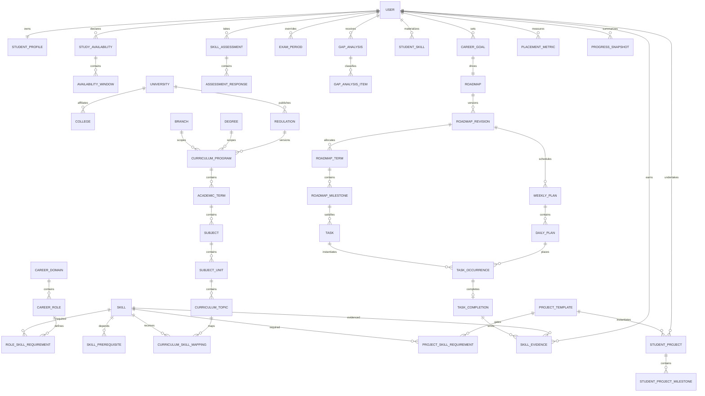

# Logical Data Model and Ownership

This Phase 0 model refines §§27–28 of the product specification. It is logical, not a migration. Phase 1 must translate it into reviewed PostgreSQL/Prisma migrations without changing ownership or invariants silently.

## Aggregate boundaries

| Aggregate/module    | Roots                                         | Owns                                                                                       | References only                             |
| ------------------- | --------------------------------------------- | ------------------------------------------------------------------------------------------ | ------------------------------------------- |
| Identity            | User, Session                                 | Auth accounts, sessions, verification tokens                                               | None                                        |
| Student Profile     | StudentProfile, CareerGoal, StudyAvailability | Profile versions, windows, exam overrides, preferences                                     | Published curriculum/role IDs               |
| Curriculum          | CurriculumProgram                             | University, regulation, degree, branch, terms, subjects, units, topics, calendar templates | Canonical skill IDs through mapping module  |
| Career Knowledge    | CareerRole, Skill, ProjectTemplate            | Requirements, prerequisites, learning units, project milestones/rubrics                    | Curriculum topic IDs through mapping module |
| Mapping             | CurriculumSkillMapping                        | Versioned topic→skill coverage/rationale                                                   | Curriculum topic and skill versions         |
| Assessment/Evidence | SkillAssessment, SkillEvidence                | Responses, diagnostics, current skill materialization                                      | User, skill                                 |
| Gap                 | GapAnalysis                                   | Per-skill classifications/contributions/effort                                             | Frozen profile/content/evidence versions    |
| Roadmap             | Roadmap                                       | Revisions, terms, milestones, logical tasks, exclusions/risks                              | Gap analysis, content versions              |
| Scheduling          | WeeklyPlan                                    | Monthly/daily plans and task occurrences                                                   | Roadmap revision/tasks, availability        |
| Progress            | TaskCompletion, WeeklyReview                  | Snapshots and aggregates                                                                   | Occurrence, user, revision                  |
| Projects            | StudentProject                                | Student milestones/artifacts                                                               | Project template/version, user              |
| Readiness           | PlacementMetric                               | Dimension results, gates, projection                                                       | Goal/role/evidence/project versions         |
| Operations          | GenerationJob, Notification, ContentImport    | Outbox, delivery, validation, audit                                                        | Owner/actor/resource identifiers            |

## Logical ER diagram

## Cross-aggregate rules

1. A client never writes a foreign aggregate directly. The owning application service validates references and commands the owner.
2. Content references include stable key and immutable version ID. Display names may change only through new versions.
3. Roadmap activation, active-pointer change, and outbox event commit in one transaction.
4. Task completion, evidence creation, and progress-outbox event commit in one transaction.
5. Materializations (`student_skills`, readiness, progress snapshots) are rebuildable; immutable sources are not overwritten.
6. Published content cannot be hard-deleted while referenced. Archival prevents new selection.
7. User deletion uses an orchestrated purge across modules; audit records retain non-identifying hashes only after the legal recovery window.

## Phase 1 migration decisions still required

- PostgreSQL enum versus lookup/check strategy for high-change states.
- Exact UUIDv7 generator implementation supported by selected Prisma/PostgreSQL versions.
- Row-level security as defense-in-depth versus service-enforced ownership only.
- Partition threshold for evidence/analytics tables; no partitioning is required before measured need.
- Artifact metadata and antivirus provider contract.

None blocks application/API scaffolding; each must have an ADR before its implementation.
