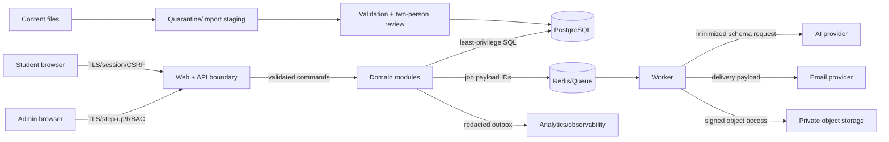

# Phase 0 Threat Model (STRIDE)

**Status:** Initial model; must be updated during Phase 1 platform design and before beta.  
**Owners:** Security Lead (accountable), Engineering Lead (implementation), Privacy Lead (data impact), QA Lead (verification).

## Assets

- Student identity/session, academic profile, availability, assessment/evidence, roadmaps, project artifacts, and privacy choices.
- Published curriculum/career content, mappings, source provenance, and reviewer decisions.
- Planning/evidence algorithms and their ruleset versions.
- Admin privileges, provider secrets, database/backups, job queues, logs, and audit history.
- Product trust: accurate, reproducible, non-overbooked plans.

## Actors

Student, content editor, content reviewer, support operator, analyst, system administrator, external auth/email/AI/storage providers, unauthenticated attacker, malicious authenticated user, compromised staff account, and compromised/poisoned content source.

## Trust boundaries and data flow

## Threat register

| ID  | STRIDE                 | Threat / impact                                                              | Required mitigation                                                                                                                  | Verification                           | Owner / phase                |
| --- | ---------------------- | ---------------------------------------------------------------------------- | ------------------------------------------------------------------------------------------------------------------------------------ | -------------------------------------- | ---------------------------- |
| T01 | Spoofing               | Stolen session or magic link exposes a student's plan/history.               | Short-lived one-use links, hashed sessions, Secure/HttpOnly/SameSite, revoke on account/security change, login rate limits.          | Auth integration and replay tests.     | Security / P1                |
| T02 | Spoofing               | Compromised editor publishes malicious content.                              | Admin MFA/step-up, editor-reviewer separation, least privilege, signed audit trail, rollback.                                        | RBAC/publish E2E.                      | Security + Content / P1–2    |
| T03 | Tampering              | Student changes user/resource IDs to access or complete another user's task. | Owner derived from session, object-level authorization, ignore client owner IDs, opaque IDs.                                         | Cross-user API matrix.                 | Backend + QA / P1, P6        |
| T04 | Tampering              | Retry creates duplicate completion/evidence/roadmap.                         | Idempotency key + request hash + uniqueness; transactional completion/evidence/outbox.                                               | Concurrent retry tests.                | Backend / P1, P6             |
| T05 | Tampering              | Poisoned import changes requirements or introduces cycles.                   | Quarantine, schema/checksum/provenance, DAG/range/reference validators, human diff and impact fixtures.                              | Invalid import corpus.                 | Content + QA / P2–3          |
| T06 | Tampering              | AI explanation introduces invented skill/resource or instruction.            | Allowlisted IDs, schema validation, approved catalog, output escaping, deterministic fallback; no domain writes.                     | Prompt injection/golden tests.         | AI + Security / P9           |
| T07 | Repudiation            | Admin denies publishing a content version.                                   | Append-only audit with actor, target/version, before/after hash, time, request ID.                                                   | Audit completeness test.               | Backend / P1–3               |
| T08 | Repudiation            | User disputes a score/plan change.                                           | Frozen input/content/ruleset versions, reason codes, revision diff, evidence timeline.                                               | Reproduction tests.                    | Roadmap + QA / P4–8          |
| T09 | Information disclosure | Logs/analytics contain email, CGPA, answers, artifact URLs, or tokens.       | Structured allowlist logging/events, central redaction, sampling audit, no request bodies by default.                                | Automated sink scan and manual sample. | Privacy + Platform / P1, P10 |
| T10 | Information disclosure | AI provider receives unnecessary identity/private data.                      | Use-case minimization matrix, pseudonymous IDs, provider no-training settings, outbound schema filter.                               | Egress fixture tests.                  | Privacy + AI / P9            |
| T11 | Information disclosure | Public/signed artifact URL leaks source or project artifact.                 | Private bucket, short expiry, unpredictable keys, auth before signing, malware scan, URL query redaction.                            | Access/expiry tests.                   | Security / P7                |
| T12 | Information disclosure | Support/analyst sees individual data outside purpose.                        | Role-filtered read models, minimum cohort sizes, consented audited support view, no raw assessment analytics.                        | Authorization/privacy UAT.             | Privacy / P1, P10            |
| T13 | Denial of service      | Generation/AI/import endpoints exhaust workers/DB.                           | Per-user/IP quotas, bounded graph/input sizes, queue concurrency, timeouts, circuit breakers, job dedupe/backpressure.               | Load/abuse tests.                      | Platform / P1, P5, P9        |
| T14 | Denial of service      | Redis/AI/email outage blocks core execution.                                 | Task commands use DB transaction only; previous plan cached/readable; AI template fallback; notification retries/dead letter.        | Provider-outage drills.                | Platform / P6, P9–10         |
| T15 | Elevation              | Student reaches admin endpoints through hidden routes/claims.                | Server-side RBAC from trusted session/DB, separate route guard, no client-authoritative claims, step-up.                             | Role fuzzing/E2E.                      | Security / P1                |
| T16 | Elevation              | SSRF through artifact/resource URL or import reference.                      | Scheme/domain allowlist, resolve/reject private IPs, isolated fetcher, size/time limits, no automatic fetch in MVP where avoidable.  | SSRF test corpus.                      | Security / P7, P9            |
| T17 | Integrity              | Mapping confidence or depth mistakenly removes required work.                | Confidence threshold, reviewed rationale, invariant tests, impact preview, low-confidence diagnostic.                                | Golden/persona regression.             | Product + Content / P4–5     |
| T18 | Integrity              | Timezone/DST bug schedules/marks wrong day.                                  | IANA timezone service, local-date key, DST fixtures, explicit timezone-change confirmation.                                          | Timezone property/E2E tests.           | Scheduling / P6              |
| T19 | Privacy                | Deleted user data reappears after backup restore.                            | Tombstone/deletion ledger outside restored set or replayed after restore; retention-aware runbook.                                   | Restore + deletion drill.              | Privacy + SRE / P10          |
| T20 | Supply chain           | Dependency/build compromise exposes secrets or app.                          | Lockfile, provenance/SBOM, code review, minimal CI permissions, secret scanning, signed artifacts, automated vulnerability scanning. | CI policy checks.                      | Platform / P1, ongoing       |

## Highest-risk abuse cases

1. Cross-user object access (`T03`).
2. Malicious or erroneous published content (`T02`, `T05`, `T17`).
3. Sensitive data leakage to logs/AI/analytics (`T09`, `T10`).
4. Duplicate or overwritten evidence under retries/revisions (`T04`, `T08`).
5. Admin privilege compromise (`T02`, `T15`).

These require automated release gates, not policy-only mitigations.

## Deferred questions before beta

- Age/minor eligibility and consent requirements for the launch cohort.
- Exact cloud/provider data residency and subprocessors.
- Artifact upload versus URL-only MVP and malware scanning contract.
- Institutional analytics and minimum cohort/privacy thresholds (not MVP).
