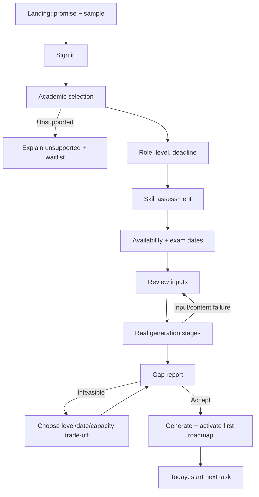
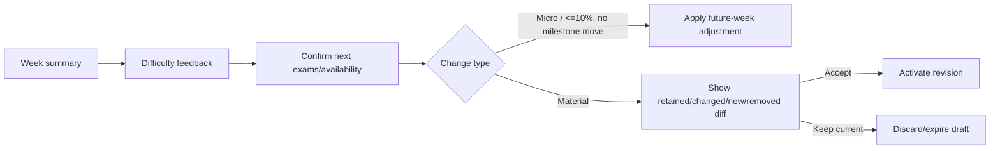

# Information Architecture and Critical Flows

## Experience rule

The student normally moves from the smallest actionable horizon to the largest context: **Today → Week → Month → Semester → Graduation**. Full-roadmap complexity is never the default landing state.

## Navigation

### Desktop

```text
Today
Roadmap
  Graduation
  Semester
  Month
Study Plan
  This week
  Daily focus
Academics
Skills
Projects
Placement
Progress
Profile
```

### Mobile

```text
[Today] [Plan] [Roadmap] [Progress] [More]

More
├── Academics
├── Skills
├── Projects
├── Placement
└── Profile
```

## Critical flow A — First roadmap



Rules:

- Autosave each completed field/step and resume.
- Unsupported curriculum stops curriculum-aware claims.
- Gap report precedes plan activation and distinguishes current, academic potential, and independent gap.
- Infeasible plans require a decision; availability/deadline never change silently.
- Loading shows server stages, not a simulated percent.

## Critical flow B — Daily execution

```text
┌──────────────────────────────────────────┐
│ Today · Tue 24 Aug          75 / 102 min │
├──────────────────────────────────────────┤
│ NEXT                                     │
│ DSA · Binary search practice      40 min │
│ Why: role required · unlocks milestone   │
│ [Start task]                    [Why?]    │
├──────────────────────────────────────────┤
│ Later                                    │
│ DBMS · SQL joins extension        35 min │
│ Project · API schema              27 min │
├──────────────────────────────────────────┤
│ Week 7/11 tasks · Next milestone Friday  │
└──────────────────────────────────────────┘
```

Start → focus session → complete/partial/skip/reschedule → capture minimal outcome/actual time → update week and evidence → return next action. There is one dominant CTA. A timer is optional and not evidence by itself.

## Critical flow C — Weekly review and adaptation



## Critical flow D — Role change

```text
Current role: Full-Stack Engineer → Proposed: Data Analyst

Retained         Depth changed       New              Removed from future
SQL              Python              Statistics       React advanced
Git                                  BI/dashboard     Frontend deployment
Programming                          Data portfolio

Hours: 284 → 241       Target readiness date: unchanged
[Keep current role]                              [Accept revision]
```

Completed history never appears under “removed.” Canonical evidence is retained even if no longer required.

## Information hierarchy by view

| View      | First                             | Second                                      | Details on demand                           |
| --------- | --------------------------------- | ------------------------------------------- | ------------------------------------------- |
| Today     | Next task/action                  | Remaining tasks + week status               | Skill trace, dependencies, roadmap context. |
| Week      | Capacity and due outcomes         | Days/tasks + catch-up                       | Estimates, revision history.                |
| Gap       | Three contribution totals + risk  | Highest-value skill gaps                    | Every mapping, confidence, effort.          |
| Roadmap   | Current/next semester milestones  | Four tracks + risks                         | Complete graduation dependencies.           |
| Skill     | Current vs required + next action | Confidence, prerequisite, curriculum source | Evidence history and all dependents.        |
| Placement | Transparent score + gate          | Highest-impact dimensions                   | Formula, evidence, historical versions.     |

## Universal states

- **Loading:** skeleton matches final layout; async work gives real stage and cancel/retry.
- **Empty:** explains whether work is complete, not yet planned, or needs an input; includes the next valid action.
- **Recoverable error:** preserves entered data and gives retry/back/edit plus correlation ID.
- **Unsupported:** plainly states missing published coverage and makes no generic AI substitution.
- **Offline:** cached plan is read-only except idempotently queued completion; visible sync state.
- **Conflict:** show server change, preserve safe local notes, and let user refresh/reapply.

## Phase 0 usability checks

Test low-fidelity flows with at least five students before visual design: can they explain the three gap totals, find today's task, understand “why,” recognize an infeasible plan, and predict what role change preserves? Target ≥4/5 successful without facilitator hints for each task.
